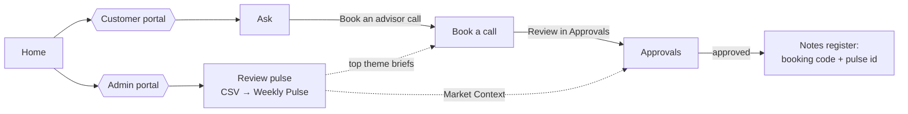

# Investor Ops & Intelligence Suite

NextLeap capstone that integrates three earlier milestones into one product for a fintech (Groww/INDmoney-style) investor-ops team:

| Pillar | What it does | Built from |
|--------|--------------|-----------|
| **A. Smart-Sync KB** | Unified search: scheme facts + fee logic in 6 cited bullets | M1 RAG + M2 Fee Explainer |
| **B. Theme-aware voice** | Voice agent greets callers with this week's top review theme and books a call | M2 Weekly Pulse + M3 Voice Scheduler |
| **C. HITL MCP Approval Center** | Calendar hold, notes line and advisor email draft (with Market Context), executed only after human approval | M2 + M3 FastMCP |

Design docs live in [`docs/`](./docs): start with [architecture.md](./docs/architecture.md) and [developmentPlan.md](./docs/developmentPlan.md).

## How to run

Requires Python 3.11–3.12 and [uv](https://docs.astral.sh/uv/). No API key is needed: without one the suite runs in deterministic mode (keyword rules, templates, mock adapters).

```bash
# 1. Install
uv sync --frozen                                  # .venv from uv.lock
cp .env.example .env                              # optional: GEMINI_API_KEY / GROQ_API_KEY

# 2. One-time model + index setup (the only steps that need the network)
uv run python scripts/download_models.py          # Qwen3 embedding + re-ranker → .models/hf
uv run python -m pillar_a_kb.ingest               # corpus → LanceDB kb_unified (494 chunks / 76 docs, 30 funds)

# 3. Run the single entry point
uv run streamlit run app.py                       # http://localhost:8501

# 4. Prove it works
uv run python -m evals.run_evals                  # 4 eval suites → docs/evalsReport.md (exit 0 = all pass)
uv run python scripts/pii_sweep.py                # PII sweep of data/ and the DB (see Phase 9)
uv run python scripts/latency_check.py            # Unified Search p50 (target < 4 s)
uv run pytest -q                                  # unit + edge-case tests
uv run ruff check . && uv run ruff format --check .
```

The Weekly Pulse is built automatically from the bundled `data/reviews/reviews.csv` the first time the app opens (`PULSE_AUTOBUILD=true`). To brief the voice agent from fresh reviews, use **Update from new reviews** on the **Book a call** page.

**Deliverables:** [`Deliverables/Evals_Report.md`](./Deliverables/Evals_Report.md) covers the Golden Dataset, the adversarial tests and the scores. [`Deliverables/Source_Manifest.md`](./Deliverables/Source_Manifest.md) lists 46 source URLs, 40 of them official, covering 30 funds. The auto-generated version of the report, [`docs/evalsReport.md`](./docs/evalsReport.md), is regenerated on every full `evals.run_evals` run.

**Opt-in switches** (all default off, every path has a deterministic fallback): `PULSE_LLM_ENABLED`, `VOICE_LLM_ENABLED`, `VOICE_STT_ENABLED`, `VOICE_TTS_ENABLED`, `EVAL_LLM_JUDGE`. Unified Search and the guardrail use the LLM only when a key is set. `ADAPTER_MODE=google` switches the MCP tools to real Calendar/Docs/Gmail; it needs `uv run python -m pillar_c_mcp.google.auth`, `GOOGLE_PREBOOKING_DOC_ID` and `ADVISOR_EMAIL`.

> **No global uv?** This repo also works with a project-local copy:
> `python3.12 -m venv .tools/uv && .tools/uv/bin/pip install uv`, then use `.tools/uv/bin/uv` and
> set `UV_CACHE_DIR=$PWD/.uv-cache`. Both folders are git-ignored.

Optional git hooks: `uv run pre-commit install` (ruff + detect-secrets).

## Product tour (UI & user flows)

The product is one Streamlit app with a front door and two portals, in the **"Linen & Caramel"**
design system ([DESIGN.md](./DESIGN.md), [PRODUCT.md](./PRODUCT.md)). The canvas is warm linen,
every tool sits on a raised card, headlines are serif, and the one primary action per view is a
caramel pill. Only the problem-statement features are exposed. Evals, health checks and operator
tools are not in the UI; evals run from the CLI.

| Page (URL) | Portal · feature | What the user sees |
|-----------|---------|--------------------|
| **Home** (`/`) | Front door | Hero headline, **Customer portal** and **Admin portal** CTAs, three raised pillar cards with live data (funds and sources, this week's top theme, follow-ups waiting), and a four-step flow strip: Upload reviews → Brief the agent → Book a call → Approve follow-ups. |
| **Ask** (`/ask`) | Customer · Pillar A, Unified Search | An ask card with five common questions and an answer card. A combined question such as *"What is the exit load for the ELSS fund and why was I charged it?"* returns six numbered points that mix the M1 factsheet fact (exit load %) and the M2 fee logic, with footnote citations and sources. A **What I can answer** card lists the 30 funds (5 Edelweiss, 25 Bajaj Finserv, grouped by AMC) and 76 sources. Coverage questions such as *"what all mutual fund sources do you have?"* are answered from that library, also as six cited points. |
| **Book a call** (`/book`) | Customer · Pillar B, Theme-aware voice agent | A call card (transcript, quick-reply chips, typed or spoken input) beside a sage **This week's briefing** card (top theme and pulse id) and a **Your booking** card (steps, then the booking code stamped *awaiting approval*). The greeting names this week's top review theme. |
| **Review pulse** (`/pulse`) | Admin · M2 Weekly Pulse | **Reviews in** (upload a CSV, or process the bundled sample) and **How the reviews were read** (rows → PII-masked → classified funnel). The result is the one-page pulse (≤ 250 words, 3 action ideas, downloadable), theme bars with the top theme highlighted, **Briefs the voice agent** (the exact greeting) and **Market Context** (the snippet added to every advisor email). |
| **Approvals** (`/approvals`, shows the pending count) | Admin · Pillar C, HITL Approval Center | A queue of booking cards beside the open booking's annexures: *Calendar hold*, *Advisor email draft* (Market Context highlighted) and *Notes line*. Actions are Approve / Edit email / Reject / Retry or *Approve all*; filed items get a sage stamp. Below, the **pre-booking notes register** lists each approved booking code with its review pulse id. |

Each page runs behind an error boundary, so one failure never takes down the others. A footer on
every page carries the disclaimer and the `[REDACTED]` caller-name rule.



## Demo script (≈ 5 min)

The script follows the problem statement, and every step works with no API key.

| # | Page | Do | Show |
|---|------|----|------|
| 1 | Home | Point at the three pillar cards and the flow strip | One product with three connected pillars and live data |
| 2 | Admin → Review pulse | Upload `evals/fixtures/reviews_fixture_nominee.csv` (or leave it empty for the bundled sample) and click **Process reviews** | The funnel (rows → masked → classified), a pulse of ≤ 250 words with 3 action ideas, the theme bars with **Nominee Updates** on top, the agent greeting and the Market Context snippet (M2) |
| 3 | Review pulse | **Try it in a call** | The greeting says *"I see many users are asking about Nominee Updates today; I can help you book a call for that!"* (Pillar B) |
| 4 | Book a call | Click the chips **Nominee Updates** → **Earliest available** → first slot → **Yes**, then type `no thanks` | A booking code like `NL-P375` stamped *awaiting approval* |
| 5 | Admin → Approvals | **Review in Approvals**, read the advisor email (Market Context highlighted), then **Approve all** | The hold, notes line and email draft are written only now and get the sage stamp (Pillar C, HITL) |
| 6 | Approvals | Scroll to the register | The same booking code with the pulse id (state persistence from M3 to the M2 notes) |
| 7 | Customer → Ask | Click **ELSS exit load**, then ask "what all mutual funds sources do you have?" and "Which fund will give me 20% returns?" | The exit load % from the M1 factsheet plus the reason it was charged from the M2 fee explainer, in six cited points; then the library of 30 funds and 76 sources; then a polite refusal (Pillar A) |
| 8 | CLI | `uv run python -m evals.run_evals` | 4/4 suites pass; open `docs/evalsReport.md` |

## Project status

| Phase | Name | Status |
|-------|------|--------|
| 0 | Project setup & migration audit | ✅ done |
| 1 | Shared core services | ✅ done |
| 2 | Data & corpus | ✅ done |
| 3 | Pillar A: Smart-Sync Knowledge Base | ✅ done |
| 4 | M2: Theme classification & Weekly Pulse | ✅ done |
| 5 | Pillar B: Theme-aware voice agent | ✅ done |
| 6 | Pillar C: MCP server + HITL Approval Center | ✅ done |
| 7 | Integrated dashboard & voice I/O | ✅ done |
| 8 | Evaluation suite | ✅ done (4/4 suites pass) |
| 9 | Hardening, docs & demo | ✅ done (demo video: script only) |

### Phase 1: shared core (`core/`)

| Module | Responsibility |
|--------|----------------|
| `pii.py` | Presidio analyzer with built-in (email, card/Luhn, IN phone, PAN, Aadhaar/Verhoeff) and custom recognizers (strict PAN, Indian mobile, UPI, folio/account with context words, ≥9-digit groups, spoken digits, context-based names incl. Hinglish). Everything becomes `[REDACTED]`; booking codes, pulse IDs, dates and times are allow-listed. |
| `guardrails.py` | `check_input`: PII flag → deterministic rules (M3 advice patterns + M1 markers + capstone rules, PII-request, injection) → LLM classifier only when no rule blocks, or a keyword fallback when offline. `check_output`: advice-phrase + PII validator with safe fallback. |
| `llm.py` | LiteLLM gateway: primary→fallback chain, timeout, temperature 0, Pydantic structured output with one corrective retry, per-call API keys, token/cost logging, opt-in Phoenix tracing (I/O hidden). |
| `state.py` | SQLModel tables from architecture §7 (pulses, bookings, actions, audit_log, scheme_facts): WAL + foreign keys, tz-aware timestamps (naive rejected), unique idempotency keys, PII-scrubbed JSON columns. |
| `logging.py` | JSON logs with PII redacted from the message, args, extras and exception text (port of M3's filter). |
| `prompts.py` + `prompts/` | Versioned prompts and §9 refusal templates (`refusals.yaml`). |

**PERSON NER:** by default `PII_NLP_MODEL=blank:en`, so no spaCy model is downloaded and names are caught by context rules ("my name is …", "mera naam …", "I'm …", "Mr. …", "name: …"). To add statistical NER, install a spaCy model yourself (e.g. `uv run python -m spacy download en_core_web_lg`) and set `PII_NLP_MODEL=en_core_web_lg`; the loader never downloads models on its own.

### Phase 2: data & corpus

| Artifact | Contents |
|----------|----------|
| `data/sources.csv` | Registry of 76 documents for 30 funds: 7 Edelweiss scheme pages (ELSS, Flexi Cap, Large Cap, Nifty 50 Index, Liquid), 50 Bajaj Finserv AMC documents (25 official scheme pages and 25 factsheet excerpts covering equity, index, hybrid, debt and ETF schemes), 12 SEBI/AMFI/AMC pages and 7 fee-explainer sections. Every row has a public URL. |
| `data/corpus/` | Scheme captures, fetched regulator pages, the M2 fee explainer, and a [README](./data/corpus/README.md) with capture methods and open data issues. |
| `config/themes.yaml` | Fixed 10-theme taxonomy with keywords and the theme → voice-topic map. |
| `config/scheme_aliases.yaml` | Colloquial names → canonical schemes (e.g. "tax saver" → ELSS). |
| `config/fee_rules.yaml` | Exit-load windows, liquid graded slabs, stamp duty 0.005%, STT 0.001%; each rule cites a `doc_id`. |
| `data/reviews/reviews.csv` | 3,678 M2 Play Store reviews, PII-scrubbed, `user_name=[REDACTED]`. |
| `evals/golden_dataset.json` | G1–G5 with expected facts, corpus evidence quotes and 6-bullet reference answers. |
| `evals/fixtures/` | Synthetic review sets: nominee-top, login-top, empty. |
| `data/availability.json` | Mock advisor calendar: 10 working days, 30-min IST slots. |

Rebuild with `scripts/fetch_corpus.py`, `scripts/port_reviews.py` and `scripts/make_availability.py`.
`tests/data/` checks the registry, configs, PII and that every golden fact is in the corpus.

### Phase 3: Pillar A — Unified Search (`pillar_a_kb/`)

| Module | Responsibility |
|--------|----------------|
| `corpus.py`, `facts.py`, `calculators.py` | Load the registry; extract `scheme_facts`; exit-load / stamp-duty / STT / TER calculators from `fee_rules.yaml`. |
| `ingest.py` | Chunk + embed (Qwen3-Embedding-0.6B) into LanceDB `kb_unified` with FTS; incremental by content hash. `uv run python -m pillar_a_kb.ingest [--rebuild]`. |
| `router.py` | Rules-first FACT / FEE / COMBINED decomposition, scheme aliases, holding days, open-ended detection. |
| `retriever.py` | Hybrid search (vector + FTS) with filters, bge-reranker-v2-m3 rerank. |
| `composer.py`, `validator.py` | Template frames (combined / concept / compare), extractive fallback, optional LLM; 6-bullet + citation + number-grounding validator. |
| `service.py`, `ui.py` | `answer()` → `KBAnswer`; Streamlit **Ask a question** page. |

Models are downloaded once with `uv run python scripts/download_models.py` into `.models/hf`; at runtime everything is offline.
Golden checks: `uv run python -m evals.rag_checks` → `evals/reports/rag_checks.{md,json}` (G1–G5 all pass).

### Phase 4: Weekly Review Pulse (`pillar_m2_pulse/`)

| Module | Responsibility |
|--------|----------------|
| `reviews.py` | CSV validation + column aliases, 12-week window, ≥ 5 words, PII scrub, `user_name=[REDACTED]`, dedupe. |
| `classifier.py`, `taxonomy.py` | Keyword rules by default; opt-in batched LLM classifier (`PULSE_LLM_ENABLED`) with a JSON cache and keyword fallback. |
| `ranking.py` | `0.6·theme_share + 0.25·negativity + 0.15·growth`, minimum evidence (≥ 5 reviews, ≥ 5% of themed), deterministic tie-breaks. |
| `quotes.py`, `pulse.py` | One PII-safe quote per top-3 theme; ≤ 250-word pulse with exactly 3 action ideas; persisted to SQLite, `data/artifacts/` and `notes.md`. |
| `market_context.py` | ≤ 60-word advisor snippet + "topic matches a top theme" line (used by Pillar C). |
| `ui.py` | Retired operator page (not in navigation). The pulse is auto-built at startup and re-briefed from **Book a call**. |

Classifier accuracy: `uv run python -m evals.classifier_accuracy` (86% on 50 hand labels; optimistic, see the report).

### Phase 5: Pillar B — Theme-aware voice agent (`pillar_b_voice/`)

| Module | Responsibility |
|--------|----------------|
| `greeting.py` | Template greeting from the latest pulse: bookable / non-bookable / generic (no pulse, no theme, or older than 14 days) + disclaimer. |
| `agent.py` | `VoiceSession` state machine (greeting → intent → topic → time → 2 slots → confirm → booked; reschedule, cancel, what-to-prepare, waitlist). `end()` writes `data/artifacts/bookings/<code>.json` and calls Pillar C's `propose_for_booking`. |
| `nlu.py`, `when.py` | Rules NLU (intents, yes/no, slot choice, booking code, IST day/part/time); opt-in LLM extraction (`VOICE_LLM_ENABLED`) only when rules find nothing. |
| `slots.py`, `booking.py`, `topics.py` | Mock calendar slots minus active bookings; `NL-A742`-style codes with spoken read-back; 6 topics with checklists. |

Each booking stores `pulse_id` and `greeting_theme`. Every turn runs the rules guard: advice, PII requests and prompt injection are refused; shared PII is masked in the transcript.

### Phase 6: Pillar C — FastMCP tools + HITL Approval Center (`pillar_c_mcp/`)

| Module | Responsibility |
|--------|----------------|
| `server.py` | FastMCP server `investor-ops-tools` (port of M3) with exactly 5 typed tools: `calendar_list_busy`, `calendar_create_hold`, `calendar_delete_hold`, `docs_append_prebooking`, `gmail_create_draft` (no send tool). Rejects PII and advice language; maps backend errors to `retryable:`/`permanent:`. `uv run python -m pillar_c_mcp.server` serves it over stdio. |
| `local/`, `google/` | `ADAPTER_MODE=mock` (default): `.ics` holds, `notes.md` lines, `.eml` drafts under `data/artifacts/`. `ADAPTER_MODE=google`: M3's Calendar/Docs/Gmail wrappers (consent: `uv run python -m pillar_c_mcp.google.auth`). |
| `client.py`, `tool_gate.py` | `ToolClient` over `fastmcp.Client` (`MCP_SERVER_TARGET` = `inprocess`, a stdio script or a URL); discovery fails if an off-list or `send` tool appears. The gate re-checks status, PII and plan args before every write. |
| `plan.py`, `templates.py` | Booking / reschedule / cancel / compensation plans; email template with the Weekly Pulse **Market Context** block and `Caller: [REDACTED]`. |
| `actions.py` | HITL outbox: voice call end → PENDING actions with pre-checks (PII, booking code, Market Context, slot still free, guardrail) → approve / edit (free text only) / reject (reason required) → ordered execution, idempotency keys, backoff 5 s→15 min, compensation (booking `NEEDS_ATTENTION` + ops alert), audit log. |
| `ui.py` | **Approvals** page: annexures with stamps, Approve / Edit / Reject / Retry, and the pre-booking notes register. |

The booking code links everything: notes line `date | topic | slot | NL-X123 | status | PULSE-…`, the calendar hold title, and the email subject.

### Phase 7: Integrated dashboard (`app.py`, `dashboard/`, `pillar_b_voice/ui.py`)

| Module | Responsibility |
|--------|----------------|
| `dashboard/health.py` | Health checks (KB index, models, LLM keys, MCP server, pulse freshness) and the pending-approvals count shown in the nav. No network calls. `overview.py` (old Home) is retired. |
| `pillar_b_voice/ui.py` | **Book a call**: this week's briefing (+ upload new reviews), chat transcript with quick-reply chips, typed input, progress, booking code and hand-off to Approvals. |
| `pillar_b_voice/speech.py` | Opt-in voice I/O: mic → Groq Whisper (`VOICE_STT_ENABLED`) and edge-tts `en-IN` playback (`VOICE_TTS_ENABLED`). Both default off; typed input always works. |
| `app.py`, `views/`, `dashboard/shell.py`, `dashboard/theme.py`, `dashboard/ui_kit.py`, `dashboard/landing.py` | Top navigation grouped as Home, Customer portal (Ask, Book a call) and Admin portal (Review pulse, Approvals with pending count). Also the pulse auto-build, the Linen & Caramel theme and card kit, and the footer disclaimer; each page runs behind an error boundary. |

### Phase 8: Evaluation suite (`evals/`)

```bash
uv run python -m evals.run_evals                 # all suites → evals/reports/eval_report_<ts>.{md,json}
uv run python -m evals.run_evals --suites safety # one suite; exit code 0 only if everything passes
```

| Eval | What it proves | Latest |
|------|----------------|--------|
| 1. RAG (G1–G5) | Faithfulness (claims only from cited, retrieved chunks), relevance (fact + fee scenario answered), 6 bullets, M1+M2 sources | 1.00 / 1.00 · 5/5 |
| 2. Safety (S1–S7) | Advice and PII requests refused on Unified Search **and** Voice; shared PAN/phone never stored in logs, transcripts, DB or artifacts | 7/7 required · 15/15 extended |
| 3. UX | Pulse ≤ 250 words with exactly 3 ideas; greeting names the top theme from the review CSV (U1–U3, stale pulse, production CSV) | 3/3 · 3/3 · 5/5 |
| 4. Integration | Booking code in notes + calendar + email, HITL gate (0 writes before approval), Market Context in the email, no PII, idempotent retries | 7/7 |

Each suite runs in a throwaway sandbox (`evals/sandbox.py`), so live bookings and notes are never touched. Scoring is deterministic by default; set `EVAL_LLM_JUDGE=true` (plus a key) to score faithfulness, relevance, refusals and pulse tone with the `LLM_JUDGE` model. A full run also writes the submission **Evals Report**, [`docs/evalsReport.md`](./docs/evalsReport.md) (Golden Dataset, adversarial tests, scores). Evals are not shown in the product UI. Baseline → final history: [docs/evals.md §8](./docs/evals.md#8-results--baseline--final).

### Phase 9: Hardening

| Task | Result |
|------|--------|
| 9.1 Edge cases | All 66 cases in [edgeCase.md](./docs/edgeCase.md) mapped to tests: 44 fully covered, 11 partially, 11 documented as different/not built ([§6](./docs/edgeCase.md#6-coverage-after-phase-91-as-built)). New tests: `tests/edge/`. |
| 9.2 PII sweep | `scripts/pii_sweep.py` scans every artifact line, CSV cell, `.eml` subject/body and every SQLite text column (public `corpus/` excluded). Current data: **0 hits in any free-text field**; 60 flagged values are all identifiers (58 `review_id` UUIDs, 2 digits inside a SEBI URL in `sources.csv`). Each is labelled with a triage note but never suppressed, so the script still exits 1; the detector was deliberately not loosened. |
| 9.3 Performance | `scripts/latency_check.py` (sandboxed, LLM off): warm p50 **≈ 0.5 s** for answered G1–G5 (p95 ≈ 0.6 s), refusals ≈ 0 ms, cold first call ≈ 3.7 s incl. model load. Target p50 < 4 s ✅. |
| 9.4 Docs | "How to run" and "Demo script" above; design changes recorded in each doc's as-built section. |
| 9.5 Demo video | Not recordable here; use the demo script above. |
| 9.6 Final summary | [docs/finalSummary.md](./docs/finalSummary.md). |
| 9.7 Clean install | See [finalSummary.md §6](./docs/finalSummary.md#6-clean-install-check). |

## Migration audit (task 0.5)

Source projects (sibling folders in `~`):
- **M1** `Mutual Fund RAG chat Bot`: INDmoney scheme pages for 5 Edelweiss funds → chunks → Chroma/Pinecone → Groq answers.
- **M2** `app review analyser`: Groww Play Store reviews → clean/PII scrub → Groq theme discovery/classification → weekly pulse → email.
- **M3** `AI Voice Agent Appointment Scheduler`: FSM voice/chat agent → booking codes → FastMCP (`fastmcp` 4.0.10) Google Calendar/Docs/Gmail with ToolGate + outbox.

Verdicts: **port** = copy and adapt imports · **port+extend** = copy, then add capstone features · **refactor** = keep the logic, restructure it · **rewrite** = replace with the stack in [techDecisions.md](./docs/techDecisions.md) (old code stays a reference/test source) · **drop** = not needed.

### M1: Mutual Fund RAG chat bot

| M1 module | New module | Verdict | Notes |
|-----------|-----------|---------|-------|
| `phase1/mf_ingest/fetcher.py`, `pipeline.py`, `storage.py` | `pillar_a_kb/ingest.py` | refactor | Keep fetch + raw/processed storage; add AMC factsheet/KIM PDFs |
| `phase1/mf_ingest/indmoney_parser.py` | `pillar_a_kb/ingest.py` (HTML source) | port | `__NEXT_DATA__` parser gives clean scheme snapshots → seed `scheme_facts` |
| `phase1/mf_ingest/models.py` | `pillar_a_kb/ingest.py` | refactor | Pydantic models reused for scheme snapshots |
| `phase2/mf_index/chunker.py` | `pillar_a_kb/ingest.py` | rewrite | Docling HybridChunker + field cards (rag.md) |
| `phase2/mf_index/embeddings.py`, `vector_store.py`, `builder.py` | `pillar_a_kb/ingest.py` | rewrite | LanceDB + Qwen3-Embedding instead of Chroma/Pinecone |
| `phase2/mf_index/retrieval.py` | `pillar_a_kb/retriever.py` | rewrite | Hybrid FTS + vector + bge reranker |
| `phase3/mf_chat/routing.py` | `core/guardrails.py` | refactor | Intent enum + refusal texts (AMFI/SEBI links) become the rule-based fast path |
| `phase3/mf_chat/relevance.py` | `pillar_a_kb/retriever.py` | refactor | "Not in sources" / AMC-not-indexed fallbacks; thresholds re-calibrated |
| `phase3/mf_chat/service.py`, `schemas.py` | `pillar_a_kb/composer.py` | refactor | Answer + source refs → 6-bullet Pydantic output |
| `phase3/mf_chat/groq_client.py` | `core/llm.py` | rewrite | LiteLLM (Gemini primary, Groq fallback) |
| `phase3/mf_chat/source_policy.py` | `pillar_a_kb/composer.py` | port | Allowed-source rule for citations |
| `phase5/mf_pipeline/*`, `api/`, `public/`, `vercel*` | — | drop | Scheduler/Vercel hosting not needed; Streamlit is the UI |
| `tests/test_mf_chat_refusal.py`, `test_routing.py` | `tests/test_guardrails.py` | port | Reuse as guardrail cases |

**Gap:** M1's 5 schemes (Flexi Cap, US Tech FoF, 3 offshore FoFs) include **no ELSS fund**, but the headline question is about ELSS. Phase 2.1 adds Edelweiss ELSS Tax Saver plus Large Cap/Index/Liquid sources.

### M2: App review analyser

| M2 module | New module | Verdict | Notes |
|-----------|-----------|---------|-------|
| `phase1_ingest/playstore_scraper.py`, `models.py` | `pillar_m2_pulse/reviews.py` | port | Optional live refresh; the CSV is the primary input |
| `phase2_clean/deduplicate.py`, `language_filter.py`, `processor.py` | `pillar_m2_pulse/reviews.py` | port | Clean + dedupe + language filter |
| `phase2_clean/pii_scrubber.py` | `core/pii.py` | rewrite | Presidio; M2 regexes (PAN/Aadhaar/UPI/phone) become custom recognizers + tests |
| `phase3_themes/theme_discovery.py` | `pillar_m2_pulse/classifier.py` (optional) | refactor | Free discovery → BERTopic "emerging themes" only; main path uses the fixed taxonomy |
| `phase3_themes/theme_classifier.py` | `pillar_m2_pulse/classifier.py` | refactor | Batching + validation kept; labels become a `Literal` over `config/themes.yaml` |
| `phase3_themes/groq_client.py` | `core/llm.py` | rewrite | LiteLLM |
| `phase4_pulse/pulse_builder.py`, `templates/pulse.md.j2` | `pillar_m2_pulse/pulse.py` | refactor | Code-first counts/quotes; enforce ≤ 250 words + exactly 3 actions |
| `phase4_pulse/action_generator.py` | `pillar_m2_pulse/pulse.py` | port | Includes deterministic fallback actions |
| — | `pillar_m2_pulse/market_context.py` | new | Advisor email snippet (Pillar C) |
| `phase5_email/*`, `railway_api/`, `phase6_ui/` | — | drop | Pulse email/UI replaced by Streamlit + MCP Gmail draft |

**Gap:** there is **no Fee Explainer** in the M2 code. Phase 2.2 writes `data/corpus/fee_explainer.md` from AMFI/SEBI/AMC public pages.

### M3: AI Voice Agent appointment scheduler

| M3 module | New module | Verdict | Notes |
|-----------|-----------|---------|-------|
| `mcp_server/server.py` | `pillar_c_mcp/server.py` | port+extend | `build_server`, 5 tools; add 6 topics, `pulse_id`, `call_summary`, `market_context` |
| `mcp_server/google_{calendar,docs,gmail,auth}.py` | `pillar_c_mcp/google/` | port | Gmail `render()` extended with Market Context |
| — | `pillar_c_mcp/local/` | new | Offline `.ics` / `notes.md` / `.eml` backends, same interface |
| `mcp_client/client.py`, `tool_gate.py`, `runner.py` | `pillar_c_mcp/{client,tool_gate,runner}.py` | port | Allow-list discovery, deterministic gate |
| `mcp_client/outbox.py` | `pillar_c_mcp/outbox.py` | port+extend | Add approval gate (PENDING until approved) |
| `mcp_client/executor.py` | `pillar_c_mcp/approval.py` | refactor | Executor triggered by approval, not call end |
| `domain/plan.py` | `pillar_c_mcp/plan.py` | port+extend | Booking/Reschedule/Cancel plans |
| `domain/codes.py` | `pillar_b_voice/booking.py` | port | `NL-[A-HJ-NP-Z][2-9]{3}` (fits the docs regex) |
| `domain/slots.py`, `timeutil.py` | `pillar_b_voice/slots.py` | port | IST slot logic |
| `nlu/rules.py`, `date_resolver.py`, `topic_mapper.py` | `pillar_b_voice/agent.py` | port+extend | 5 → 6 topics |
| `nlu/gemini.py` | `core/llm.py` | rewrite | LiteLLM structured output |
| `nlu/tool_agent.py` | — | drop | Calls are fixed by the plan |
| `orchestrator/fsm.py`, `handlers/*`, `templates.yaml` | `pillar_b_voice/agent.py`, `greeting.py` | refactor | Theme-aware greeting from `pulse.json` |
| `guardrails/advice.py`, `output_check.py` | `core/guardrails.py` | refactor | Merged with M1 routing rules |
| `guardrails/pii.py` | `core/pii.py` | rewrite | Presidio |
| `storage/sqlite.py` | `core/state.py` | refactor | SQLModel, schema from architecture §7 |
| `logging.py` | `core/logging.py` | port | Add PII scrub on every record |
| `channels/voice/google_speech.py`, converters | `pillar_b_voice/audio.py` | rewrite | `st.audio_input` + Groq Whisper + edge-tts |
| `channels/chat/*` (FastAPI), `secure/*` | — | drop | Streamlit UI; no PII is collected, so no vault |
| `tests/fake_google.py`, `tests/unit/mcp/*` | `tests/` | port | Contract + gate + outbox tests |
