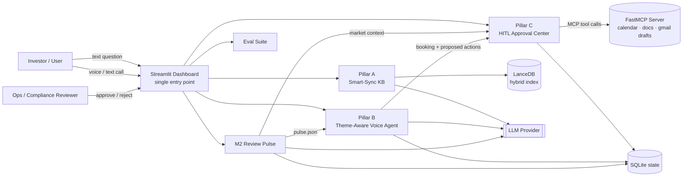
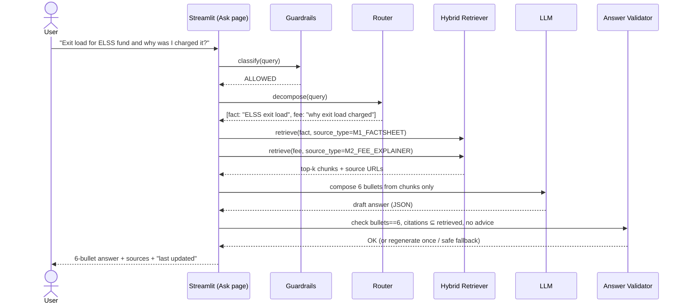
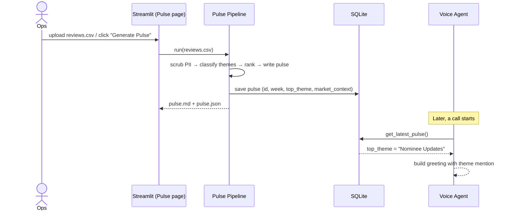
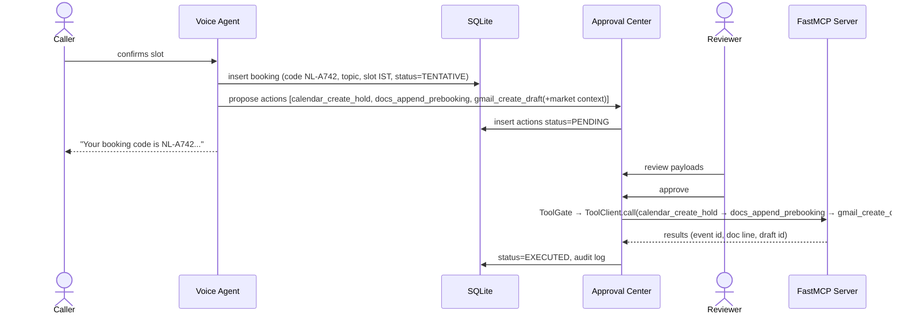

# Architecture — Investor Ops & Intelligence Suite

> High-level design of the integrated product. Each pillar has a detailed sub-document:
>
> | Doc | Covers |
> |-----|--------|
> | [architecture/rag.md](./architecture/rag.md) | Pillar A — Smart-Sync Knowledge Base (M1 + M2 RAG) |
> | [architecture/themeClassification.md](./architecture/themeClassification.md) | M2 review pipeline, theme classification, Weekly Pulse, Market Context |
> | [architecture/voiceagent.md](./architecture/voiceagent.md) | Pillar B — Theme-Aware Voice Agent (M3) |
> | [architecture/mcpIntegration.md](./architecture/mcpIntegration.md) | Pillar C — MCP tools + HITL Approval Center |
>
> Related: [problemStatement.md](./problemStatement.md) · [rules.md](./rules.md) · [edgeCase.md](./edgeCase.md) · [evals.md](./evals.md) · [developmentPlan.md](./developmentPlan.md) · [techDecisions.md](./techDecisions.md)

---

## 1. Design Principles

1. **One product, shared services.** Pillars share one LLM client, one PII scrubber, one guardrail layer, one state store. No copy-pasted logic between milestones.
2. **Facts only, always cited.** Customer-facing answers come only from the indexed corpus; every claim has a source link.
3. **Safety before generation.** Every user input passes the guardrail (advice / PII / out-of-scope) **before** retrieval or LLM calls.
4. **Human approves side effects.** No calendar, email or doc write happens without an approval in the HITL Approval Center.
5. **Artifacts as contracts.** Pillars talk through versioned JSON artifacts (`pulse.json`, `booking.json`) and the state DB — not through hidden in-memory coupling.
6. **Deterministic where possible.** Word limits, bullet counts, booking codes, theme ranking and citation checks are enforced in code, not left to the LLM.
7. **Mock-first adapters.** Every external integration (Calendar, Gmail, Docs, STT/TTS) has a local mock so the full demo + evals run offline.

---

## 2. System Context



---

## 3. Tech Stack (recommended)

> Options, trade-offs and the reasons for each choice: [techDecisions.md](./techDecisions.md).

| Concern | Choice | Notes / Alternatives |
|---------|--------|----------------------|
| Language & tooling | Python 3.11+, **uv** (lockfile), **ruff**, **pytest**, pre-commit | |
| UI (single entry point) | **Streamlit** (`st.navigation` multipage, native `st.audio_input`) | Gradio / Chainlit considered |
| LLM | **LiteLLM** → **Gemini Flash** (primary) · **Groq-hosted open model** (fallback + low-latency voice NLU) | temperature 0–0.2; judge model ≠ generator |
| Structured outputs | **Pydantic** schemas + provider-native JSON-schema output, 1 retry on validation error | |
| Document parsing | **Docling** (PDF tables/layout) · trafilatura (HTML) · PyMuPDF4LLM (fallback) | |
| Fact store | **`scheme_facts`** table (SQLite) + **`fee_rules.yaml`** calculators | Deterministic numbers |
| Embeddings | **Qwen3-Embedding-0.6B** (local) | Hosted Gemini embeddings when cloud-deployed |
| Vector + keyword search | **LanceDB** (embedded; native full-text + vector hybrid, RRF, pre-filters) | Qdrant/pgvector at scale |
| Reranker | **bge-reranker-v2-m3** cross-encoder (on by default) | Qwen3-Reranker-0.6B alternative |
| PII | **Microsoft Presidio** (`IN_PAN`, `IN_AADHAAR`, phone, email, card) + custom folio/UPI recognizers + spaCy NER | |
| Guardrails | Rules → domain intent classifier (LLM, structured) → output validator | Llama Guard 4 optional |
| Review processing | pandas + LLM fixed-taxonomy classifier | BERTopic offline for `Other` discovery |
| State store | **SQLite (WAL)** via SQLModel | bookings, approvals, audit, pulses, scheme_facts |
| MCP | **FastMCP (`fastmcp` 4.x)** server + `fastmcp.Client` — ported from M3 (`build_server`, `ToolClient`, `ToolGate`, outbox) | 5 least-privilege tools; in-process / stdio / HTTP |
| Calendar / Email / Notes | Mocks (`.ics`, `.eml`, `notes.md`) by default · Google Calendar, Gmail `drafts.create`, Google Docs live | |
| Voice | `st.audio_input` → **Groq Whisper large-v3-turbo** (faster-whisper fallback) → FSM → **edge-tts `en-IN` neural voice** | Text-mode fallback; Pipecat real-time = stretch |
| Evals | **DeepEval** (pytest) + deterministic checks | Promptfoo red-team optional; report → `evals/reports/` |
| Observability | **Arize Phoenix** (local OpenTelemetry traces) + PII-scrubbed JSON logs | Langfuse alternative |
| Config | `pydantic-settings` + `.env` | No secrets in repo |

---

## 4. Proposed Repository Layout

```
.
├── app.py                         # Streamlit single entry point
├── pyproject.toml / uv.lock       # dependencies (uv)
├── config/
│   ├── settings.py                # env + constants (limits, timezone, model names)
│   ├── themes.yaml                # fixed theme taxonomy (M2)
│   ├── scheme_aliases.yaml        # colloquial → canonical scheme names
│   └── fee_rules.yaml             # structured fee rules for calculators
├── prompts/                       # versioned prompt templates
├── core/                          # shared services
│   ├── llm.py                     # thin wrapper over LiteLLM (fallbacks, structured output, tracing)
│   ├── guardrails.py              # advice / PII / scope classifier + refusal templates
│   ├── pii.py                     # Presidio analyzer/anonymizer → [REDACTED]
│   ├── state.py                   # SQLite access (bookings, approvals, audit, pulses)
│   └── logging.py                 # structured, PII-safe logs
├── pillar_a_kb/
│   ├── ingest.py                  # Docling parse → HybridChunker → LanceDB; extract scheme_facts
│   ├── facts.py                   # scheme_facts lookup + fee calculators
│   ├── retriever.py               # LanceDB hybrid (FTS + vector) + reranker, metadata filters
│   ├── router.py                  # query decomposition: fact / fee / combined
│   └── composer.py                # 6-bullet answer + citations + validator
├── pillar_m2_pulse/
│   ├── reviews.py                 # CSV load, clean, PII scrub, dedupe
│   ├── classifier.py              # theme classification
│   ├── pulse.py                   # Weekly Pulse generation + validators
│   └── market_context.py          # snippet for advisor email
├── pillar_b_voice/
│   ├── agent.py                   # dialog state machine
│   ├── greeting.py                # theme-aware greeting
│   ├── slots.py                   # availability + IST handling
│   ├── booking.py                 # booking code generation
│   └── audio.py                   # STT / TTS wrappers
├── pillar_c_mcp/                  # ported from M3 (see architecture/mcpIntegration.md §2.1)
│   ├── server.py                  # FastMCP build_server(calendar, docs, gmail) + 5 tools
│   ├── google/                    # M3 Google Calendar / Docs / Gmail wrappers + auth
│   ├── local/                     # offline .ics / notes.md / .eml backends (same interface)
│   ├── client.py                  # ToolClient (fastmcp.Client, allow-list discovery)
│   ├── tool_gate.py               # ToolGate: deterministic policy per call
│   ├── runner.py                  # GatedToolRunner
│   ├── plan.py                    # BookingPlan / ReschedulePlan / CancelPlan
│   ├── outbox.py                  # outbox worker: retries, backoff, compensation
│   ├── actions.py                 # build proposed actions after call ends
│   └── approval.py                # HITL queue state machine
├── data/
│   ├── corpus/                    # M1 factsheets/KIM/SID (pdf/html) + M2 fee explainer (md)
│   ├── sources.csv                # url, title, scheme, doc_type, fetched_on
│   ├── reviews/reviews.csv        # M2 input
│   └── artifacts/                 # pulse.json, notes.md, *.ics, *.eml (mock outputs)
├── evals/
│   ├── golden_dataset.json        # 5 RAG questions
│   ├── adversarial.json           # safety prompts
│   ├── run_evals.py               # single command runner
│   └── reports/                   # generated eval reports
├── tests/                         # unit tests
└── docs/                          # this folder
```

---

## 5. Component Overview

### 5.1 Shared Core

| Component | Responsibility |
|-----------|----------------|
| `core/guardrails.py` | Classifies every inbound user message into `ALLOWED`, `ADVICE`, `PII_REQUEST`, `PII_SHARED`, `OUT_OF_SCOPE`. Rule-based fast path (regex/keywords) + LLM classifier fallback. Returns refusal templates. Used by Pillar A, B and Evals. |
| `core/pii.py` | Microsoft Presidio: masks phone, email, PAN, Aadhaar, folio/account/UPI, card numbers, person names → `[REDACTED]`. Runs on review CSV ingest, user inputs, LLM outputs, logs, traces and MCP payloads. |
| `core/llm.py` | Thin wrapper over LiteLLM: `complete(system, messages, schema: type[BaseModel] \| None, temperature=0)`. Primary/fallback routing, 1 validation retry, timeouts, token + cost logging, Phoenix tracing. |
| `core/state.py` | SQLite tables (see §7). Single source of truth for booking codes and approval status. |

### 5.2 Pillar A — Smart-Sync KB
Unified index over **M1 scheme documents** and **M2 fee explainer**. A router decomposes questions into *fact* and *fee* sub-queries, retrieves from both, and composes a **6-bullet cited answer**. Details: [rag.md](./architecture/rag.md).

### 5.3 M2 Review Pulse (feeds B and C)
Review CSV → PII scrub → theme classification (fixed taxonomy) → ranking → Weekly Pulse (≤ 250 words, top 3 themes, 3 quotes, exactly 3 action ideas) → `pulse.json` with `top_theme` and `market_context`. Details: [themeClassification.md](./architecture/themeClassification.md).

### 5.4 Pillar B — Theme-Aware Voice Agent
Reads the latest `pulse.json` at session start and injects the top theme into the greeting. Runs the booking dialog (topic → slot → confirm), generates a Booking Code, and on call end emits proposed MCP actions. Details: [voiceagent.md](./architecture/voiceagent.md).

### 5.5 Pillar C — HITL Approval Center
Every side effect (calendar hold, notes line, email draft) becomes a `pending` outbox job. A reviewer previews, edits, approves or rejects. Approved jobs pass M3's ToolGate and are executed through the FastMCP server (ported from M3) with retries and idempotency keys. Email drafts include the Market Context snippet. Details: [mcpIntegration.md](./architecture/mcpIntegration.md).

---

## 6. End-to-End Data Flows

### 6.1 Flow 1 — Unified Search (Pillar A)



### 6.2 Flow 2 — Weekly Pulse → Voice Agent briefing (Pillar B)



### 6.3 Flow 3 — Call end → HITL → MCP (Pillar C)



---

## 7. Data Model (SQLite)

```sql
CREATE TABLE pulses (
  pulse_id        TEXT PRIMARY KEY,          -- e.g. PULSE-2026-W40
  week_start      DATE, week_end DATE,
  review_count    INTEGER,
  top_theme       TEXT,                      -- from fixed taxonomy
  themes_json     TEXT,                      -- ranked themes with counts + sentiment
  pulse_md        TEXT,                      -- ≤ 250 words
  action_ideas    TEXT,                      -- JSON array, length == 3
  market_context  TEXT,                      -- ≤ 60 words, for advisor email
  created_at      TIMESTAMP
);

CREATE TABLE bookings (
  booking_code    TEXT PRIMARY KEY,          -- NL-[A-Z][0-9]{3}
  topic           TEXT,                      -- from topic list
  slot_start_ist  TIMESTAMP, slot_end_ist TIMESTAMP,
  status          TEXT,                      -- TENTATIVE | CONFIRMED | CANCELLED | RESCHEDULED
  pulse_id        TEXT REFERENCES pulses,    -- which pulse briefed the call
  greeting_theme  TEXT,                      -- theme mentioned in greeting
  caller_label    TEXT DEFAULT '[REDACTED]',
  created_at      TIMESTAMP
);

CREATE TABLE actions (
  action_id       TEXT PRIMARY KEY,
  booking_code    TEXT REFERENCES bookings,
  tool            TEXT,                      -- calendar_create_hold | calendar_delete_hold | docs_append_prebooking | gmail_create_draft
  payload_json    TEXT,                      -- tool args, PII-scrubbed
  status          TEXT,                      -- PENDING | APPROVED | RETRYING | REJECTED | EXECUTED | FAILED
  idempotency_key TEXT UNIQUE,               -- {code}:{tool}:{version}, e.g. NL-A742:calendar_create_hold:1
  attempts        INTEGER DEFAULT 0, next_attempt_at TIMESTAMP,
  result_json     TEXT,
  reviewer        TEXT, decided_at TIMESTAMP, executed_at TIMESTAMP
);

CREATE TABLE audit_log (
  id INTEGER PRIMARY KEY AUTOINCREMENT,
  ts TIMESTAMP, actor TEXT, event TEXT, ref_id TEXT, details_json TEXT
);

-- Pillar A: deterministic factsheet values (numbers are looked up, not generated)
CREATE TABLE scheme_facts (
  id INTEGER PRIMARY KEY AUTOINCREMENT,
  scheme TEXT NOT NULL, field TEXT NOT NULL,      -- e.g. exit_load, expense_ratio, lock_in, min_sip
  value TEXT, unit TEXT, conditions TEXT,
  source_doc_id TEXT NOT NULL, page INTEGER, url TEXT NOT NULL, as_of DATE,
  verified_by_human INTEGER DEFAULT 0,
  UNIQUE (scheme, field, source_doc_id)
);
```

Chunks and embeddings live in LanceDB (`data/lancedb/kb_unified`), not SQLite.

### State Persistence Requirement
The **Booking Code** travels through: `bookings` row → calendar hold title → notes doc line → email draft subject/body → audit log. The Notes doc (`data/artifacts/notes.md` or Google Doc) contains a line such as:

```
| 2026-10-03 | NL-A742 | Nominee Updates | 2026-10-06 15:00–15:30 IST | TENTATIVE | Pulse: PULSE-2026-W40 |
```

This is the visible proof that M3 (voice) and M2 (notes/pulse) are connected.

---

## 8. Artifact Contracts

### `pulse.json` (produced by M2, consumed by B and C)

```json
{
  "pulse_id": "PULSE-2026-W40",
  "period": {"start": "2026-09-27", "end": "2026-10-03"},
  "review_count": 412,
  "themes": [
    {"name": "Nominee Updates", "count": 96, "share": 0.23, "sentiment": -0.41},
    {"name": "Login Issues", "count": 81, "share": 0.20, "sentiment": -0.62},
    {"name": "Withdrawal Delays", "count": 54, "share": 0.13, "sentiment": -0.55}
  ],
  "top_theme": "Nominee Updates",
  "quotes": ["...", "...", "..."],
  "action_ideas": ["...", "...", "..."],
  "pulse_md": "...",
  "word_count": 231,
  "market_context": "This week 23% of reviews mention nominee updates (mostly negative) ...",
  "generated_at": "2026-10-03T10:00:00+05:30"
}
```

### `booking.json` (produced by B, consumed by C)

```json
{
  "booking_code": "NL-A742",
  "topic": "Nominee Updates",
  "slot": {"start": "2026-10-06T15:00:00+05:30", "end": "2026-10-06T15:30:00+05:30", "tz": "Asia/Kolkata"},
  "caller": "[REDACTED]",
  "pulse_id": "PULSE-2026-W40",
  "greeting_theme": "Nominee Updates",
  "call_summary": "Caller wants help updating nominee details. No account details collected."
}
```

---

## 9. UI — Single Entry Point (Streamlit)

`app.py` builds the product with `st.navigation(position="top")` and no sidebar. Navigation has three groups: **Home** (the default), the **Customer portal** (Ask, Book a call) and the **Admin portal** (Review pulse, Approvals). Each page file in `views/` calls `dashboard.shell.run_page`, which imports the pillar UI lazily behind an error boundary. The visual system is **"Linen & Caramel"** (see [DESIGN.md](../DESIGN.md)). It uses a warm linen canvas, raised card-stock cards with layered warm shadows, serif headlines, a caramel pill for the primary action, sage for done and for the voice brief, and iris for Market Context. Theme tokens live in `.streamlit/config.toml` and `dashboard/theme.py` (CSS and icons). `dashboard/ui_kit.py` provides the components: `card`/`card_head`/`icon`, masthead, tags, notes, stamps, steps, key-value lists, bars, empty states and the footer. `dashboard/landing.py` is the Home page.

| Page (URL) | Pillar | Key elements |
|------------|--------|--------------|
| Home (`/`, default) | all | Hero headline and Customer/Admin portal CTAs. Three link cards, one per pillar, with live data: funds and sources, this week's top theme, and follow-ups waiting. A four-step flow strip. |
| Ask (`/ask`) | A | An ask card with five common questions. An answer card shows six numbered points with footnote citations and sources, earlier questions, and a *Book an advisor call* CTA. The **What I can answer** library card lists funds, source counts and every source. Coverage questions (for example *"what sources do you have?"*) are detected in the UI with `catalog.is_catalog_question` and answered from the library in six cited points without retrieval. A *Load the library* empty state shows if the index is missing. |
| Book a call (`/book`) | B | The call card has the transcript, quick-reply chips and typed input, with opt-in mic/TTS. The sage *This week's briefing* card shows the top theme and pulse id; its **Update from new reviews** popover runs `run_pulse`. The *Your booking* card shows steps, the booking code reference block stamped *awaiting approval*, and a hand-off to Approvals. |
| Review pulse (`/pulse`) | M2 → B, C | The intake card takes a CSV upload or the bundled sample; options set the week and LLM use. A funnel card shows rows → PII-masked → classified. The pulse doc card shows word count, action-idea count and a download. Theme bars highlight the top theme. *Briefs the voice agent* shows the greeting with *Try it in a call*, and *Market Context* shows the email snippet. Processing restarts the voice call so the next greeting uses the new pulse. |
| Approvals (n) (`/approvals`) | C | A queue of booking cards; the selected one is caramel-tinted. Each booking has annexure cards for the calendar hold, the advisor email draft (Market Context highlighted) and the notes line, each with a status stamp. Actions are Approve / Edit email / Reject (with reason) / Retry and *Approve all*. The **pre-booking notes register** card lists booking code and review pulse id. |

On first load, `ensure_pulse()` builds the Weekly Pulse once per session from the bundled reviews CSV if none exists (`PULSE_AUTOBUILD`, default on). This makes the greeting theme-aware from the first visit. Demo flow: Review pulse → *Try it in a call* → Book a call → *Review in Approvals* → Approvals → register, then Ask. A footer on every page carries the disclaimer *"Facts only. No investment advice."* and the `[REDACTED]` rule.

Evals, health checks and configuration are operator tools and are **not** in the UI. Evals run from the CLI (`uv run python -m evals.run_evals`) and write [`docs/evalsReport.md`](./evalsReport.md). The older operator pages (`views/{notes,evals,health}.py`, `dashboard/overview.py`, `evals/ui.py`) are retired and not registered in navigation.

---

## 10. Configuration (`.env` / `settings.py`)

| Key | Default | Purpose |
|-----|---------|---------|
| `LLM_PRIMARY` / `LLM_FALLBACK` | `gemini/<current Flash model>` / `groq/<current open model>` | LiteLLM model strings (pin exact names at setup) |
| `LLM_VOICE_NLU` | `groq/<current open model>` | Low-latency slot extraction |
| `LLM_JUDGE` | stronger model, different from generator | Eval judge |
| `EMBED_PROVIDER` / `EMBED_MODEL` | `local` / `Qwen/Qwen3-Embedding-0.6B` | `gemini` for cloud deploy |
| `RERANK_MODEL` | `BAAI/bge-reranker-v2-m3` | Cross-encoder reranker |
| `KB_LITE` | `false` | `true` on Streamlit Community Cloud (`cloud/streamlit_app.py`): keyword-only index in `data/lancedb_lite`, no torch/local models |
| `STT_MODEL` / `TTS_VOICE` | `groq/whisper-large-v3-turbo` / `en-IN-NeerjaNeural` | Voice |
| `TOP_K` | `5` per sub-query (after rerank of 16 candidates) | Retrieval depth |
| `MIN_RELEVANCE` | calibrated on golden set (reranker score) | Below this → "not in sources" fallback |
| `PULSE_MAX_WORDS` | `250` | Pulse limit |
| `PULSE_ACTION_IDEAS` | `3` | Exact count |
| `TIMEZONE` | `Asia/Kolkata` | All slots and timestamps |
| `ADAPTER_MODE` | `mock` | `mock` (local backends) or `google` (M3 Google wrappers) |
| `MCP_SERVER_TARGET` | `inprocess` | `inprocess` · `pillar_c_mcp/server.py` (stdio) · `http://localhost:8001/mcp` |
| `MCP_CALL_TIMEOUT_S` | `10` | Per tool call (M3 default) |
| `GOOGLE_PREBOOKING_DOC_ID` / `GOOGLE_CALENDAR_ID` | — / `primary` | Google mode only |
| `ADVISOR_EMAIL` | `advisor@example.com` | Draft recipient (placeholder, not real PII) |

---

## 11. Non-Functional Requirements

| Area | Target |
|------|--------|
| Latency | Unified Search p50 < 4 s; voice turn (text mode) < 3 s |
| Reliability | Retryable tool errors back off and retry (M3 outbox: 5 s → 15 min); permanent errors → action `FAILED` with a retry button; no data loss |
| Safety | 100% refusal on adversarial set; 0 PII leaks in outputs/logs |
| Observability | Structured JSON logs (PII-scrubbed), audit log for every approval decision |
| Reproducibility | `python -m evals.run_evals` reproduces the eval report; seeds fixed |
| Offline demo | `ADAPTER_MODE=mock` runs end-to-end without Google credentials |

---

## 12. Security & Compliance Summary

- Guardrails run **before** retrieval and **after** generation (input + output check).
- PII masked at ingest, input, output, logging and MCP payload boundaries.
- Gmail is **draft-only**; the system never sends email.
- Calendar events are **holds** (tentative) until a human approves.
- Secrets only in `.env` (git-ignored). OAuth tokens stored locally, never logged.

Full rules: [rules.md](./rules.md). Failure handling: [edgeCase.md](./edgeCase.md).
