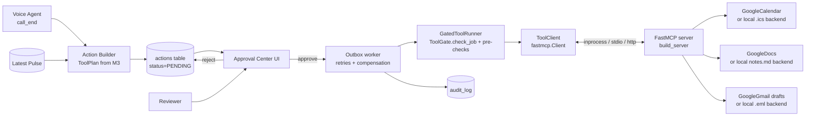
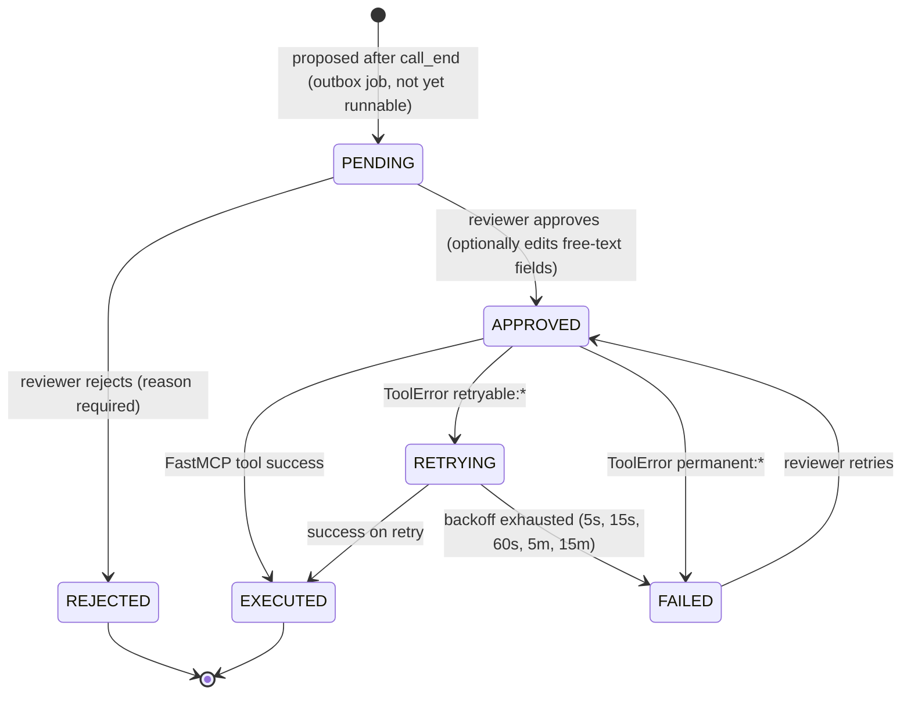

# Pillar C — "Super-Agent" MCP Workflow & HITL Approval Center

> Parent: [../architecture.md](../architecture.md) · Inputs: [voiceagent.md](./voiceagent.md) (booking), [themeClassification.md](./themeClassification.md) (market context)

## 1. Purpose

Consolidate **all side-effecting actions** from M2 and M3 into one **Human-in-the-Loop Approval Center**. Nothing is written to a calendar, inbox or doc until a reviewer approves it.

When a voice call ends the system proposes:
1. **Calendar Hold** (tentative event)
2. **Notes/Doc entry** (booking log — proves state persistence)
3. **Email Draft** to the advisor — **including a Market Context snippet** from the Weekly Pulse

---

## 2. Components

The MCP layer is **ported from M3 ("AI Voice Agent Appointment Scheduler")**, which already runs a FastMCP server on real Google Calendar / Docs / Gmail. We reuse its modules and add the HITL Approval Center between "action proposed" and "tool executed".



### 2.1 Reuse map from M3

| Capstone module | M3 source (`src/advisor_agent/…`) | Reuse |
|-----------------|-----------------------------------|-------|
| `pillar_c_mcp/server.py` | `mcp_server/server.py` (`build_server(calendar, docs, gmail)`) | Port; add `pulse_id` / `market_context` params and the 6 capstone topics |
| `pillar_c_mcp/google/` | `mcp_server/google_calendar.py`, `google_docs.py`, `google_gmail.py`, `google_auth.py` | Port as-is; extend the Gmail template with the Market Context block |
| `pillar_c_mcp/local/` | *(new)* — same method signatures as the Google wrappers, writes `.ics` / `notes.md` / `.eml` | New, modelled on M3's `tests/fake_google.py` |
| `pillar_c_mcp/client.py` | `mcp_client/client.py` (`ToolClient`) | Port as-is |
| `pillar_c_mcp/tool_gate.py` | `mcp_client/tool_gate.py` (`ToolGate`) | Port; state rules replaced by "action status must be `APPROVED`" |
| `pillar_c_mcp/runner.py` | `mcp_client/runner.py` (`GatedToolRunner`) | Port as-is |
| `pillar_c_mcp/outbox.py` | `mcp_client/outbox.py` (`OutboxWorker`, backoff, compensation) | Port; jobs start in `PENDING` (approval) instead of runnable |
| `pillar_c_mcp/plan.py` | `domain/plan.py` (`BookingPlan`, `ReschedulePlan`, `CancelPlan`, `hold_event_id`) | Port as-is |
| `tests/contract/test_mcp_server.py` | `tests/unit/mcp/test_mcp_server.py` | Port (in-process `Client(mcp)`) |

Not needed here: M3's Gemini tool agent (`nlu/tool_agent.py`). In the capstone the calls are fixed by the booking plan when the call ends, so having an LLM propose them adds nothing. The ToolGate still checks every call against the plan.

---

## 3. FastMCP Server — Tools

Built exactly as in M3:

- **Package:** standalone **`fastmcp>=4.0,<5`** (M3 declares `>=2.10` and runs 4.0.10). Server: `fastmcp.FastMCP`; client: `fastmcp.Client`. We do not use the copy bundled in the official SDK (`mcp.server.fastmcp`), so the server, client, error types and tests stay compatible with the M3 code.
- **Factory with injected backends:** `build_server(calendar, docs, gmail) -> FastMCP`. `ADAPTER_MODE` decides whether the Google wrappers or the local file backends are injected; the tools themselves are identical.
- **Typed tools:** `@mcp.tool()` async functions whose parameters are `Annotated[str, Field(pattern=…)]` / `Literal[…]`, so FastMCP generates strict input schemas (IST datetime pattern, booking-code regex `NL-[A-HJ-NP-Z]\d{3}`, topic enum, status enum).
- **PII check in every tool:** `_check_no_pii(args)` (Presidio) raises `ToolError("permanent:pii …")`.
- **Error contract:** blocking Google calls run via `asyncio.to_thread`. Failures raise `ToolError("retryable:<status>")` (timeouts, 408, 429, 5xx) or `ToolError("permanent:<reason>")`, so the outbox worker knows whether to back off.
- **Transports** (`MCP_SERVER_TARGET`):
  - `inprocess` is the default inside Streamlit and tests. The app builds the server and talks to it through `Client(mcp)`, still over the MCP protocol.
  - A `.py` path runs the server over stdio via `PythonStdioTransport`, with the environment passed explicitly.
  - `http://…/mcp` connects to a server started with `python -m pillar_c_mcp.server --transport http --port 8001`.

**Why our own server (least privilege):** community Google Workspace MCP servers expose send, edit and delete. Ours exposes only the five tools below. There is no send tool: on discovery, `ToolClient.declarations()` raises `UnexpectedToolError` if the server lists any tool outside the allow-list or with "send" in its name. See [techDecisions.md](../techDecisions.md) §6.4.

| Tool | Kind | Inputs (validated by type hints) | Behaviour |
|------|------|----------------------------------|-----------|
| `calendar_list_busy` | read | `start_ist`, `end_ist` | Busy intervals on the advisor calendar. Used by the "slot still free" pre-check; needs no approval. |
| `calendar_create_hold` | write | `code`, `topic`, `start_ist`, `end_ist`, `kind` (`booking`/`waitlist`), `version` | Tentative event `Advisor Q&A — {topic} — {code}`; deterministic event id `hold_event_id(code, kind, version)`, so a retry never duplicates it. |
| `calendar_delete_hold` | write | `event_id` | Releases a hold (cancel, or the old slot on reschedule). Idempotent. |
| `docs_append_prebooking` | write | `date`, `topic`, `slot`, `code`, `status`, `pulse_id` | Appends a line to the **"Advisor Pre-Bookings"** doc. **This is where the Booking Code becomes visible in the Notes/Doc.** |
| `gmail_create_draft` | write | `template`, `code`, `topic`, `slot`, `call_summary`, `market_context`, `pulse_id` | Renders the fixed template (§4) server-side and creates a **draft only** (`drafts.create`). |

Capstone extensions to M3's signatures:
- `topic` Literal = the 6 capstone booking topics ([voiceagent.md](./voiceagent.md)) instead of M3's 5.
- `docs_append_prebooking.pulse_id` is new.
- `gmail_create_draft` gains `call_summary` (≤ 300 chars), `market_context` (≤ 600 chars) and `pulse_id`.

All free-text fields are length-capped and PII-checked.

### 3.1 Example call: `calendar_create_hold`
```json
{
  "code": "NL-A742",
  "topic": "Nominee Updates",
  "start_ist": "2026-10-06T15:00:00+05:30",
  "end_ist": "2026-10-06T15:30:00+05:30",
  "kind": "booking",
  "version": 1
}
```
Returns `{event_id, created, html_link}`. A second call returns the same `event_id` with `created: false`. The local backend writes `data/artifacts/holds/NL-A742.ics`.

### 3.2 Example call: `docs_append_prebooking`
```json
{
  "date": "2026-10-03",
  "topic": "Nominee Updates",
  "slot": "Tue, 6 Oct, 3:00 PM IST",
  "code": "NL-A742",
  "status": "tentative",
  "pulse_id": "PULSE-2026-W40"
}
```
Appended line: `2026-10-03 | Nominee Updates | Tue, 6 Oct, 3:00 PM IST | NL-A742 | tentative | PULSE-2026-W40`. The local backend appends the same line to `data/artifacts/notes.md`.

### 3.3 Example call: `gmail_create_draft`
```json
{
  "template": "booking",
  "code": "NL-A742",
  "topic": "Nominee Updates",
  "slot": "Tue, 6 Oct, 3:00 PM IST",
  "call_summary": "Caller wants to update the nominee on an existing folio.",
  "market_context": "This week 31% of reviews mention Nominee Updates (mostly negative) …",
  "pulse_id": "PULSE-2026-W40"
}
```
Gmail backend: `drafts.create` only, never `send`. The local backend writes `data/artifacts/drafts/NL-A742.eml`.

### 3.4 Reschedule / cancel (M3 plans)
- **Reschedule** (`ReschedulePlan`): same code, `version + 1`. Create the new hold, then delete the old one by its deterministic id. If the create fails permanently, the delete is skipped so the client never ends up with no hold. Also append a `rescheduled` notes line and create a `reschedule` draft.
- **Cancel** (`CancelPlan`): `calendar_delete_hold`, a `cancelled` notes line and a `cancel` draft.
- The notes doc is append-only; history is never edited.

---

## 4. Advisor Email Template (with Market Context)

```
Subject: [Pre-booking] {booking_code} — {topic} — {slot_human} IST

Hi Advisor,

A tentative advisor call has been requested.

• Booking code: {booking_code}
• Topic: {topic}
• Slot: {slot_human} IST (tentative — please confirm)
• Caller: [REDACTED] (contact details will be shared via the secure link)
• Call summary: {call_summary}

📈 Market Context (from Weekly Pulse {pulse_id}, {period}):
{market_context}

Reminder: provide factual information only; no investment advice on record.

— Investor Ops Suite (auto-drafted, approved by {reviewer})
```

- `market_context` comes from `build_market_context(pulse, topic)` ([themeClassification.md §8](./themeClassification.md)).
- The template is rendered **inside the FastMCP server** (M3's `google_gmail.render()` extended with the Market Context block), so callers pass fields, not a free-form body. A tool caller cannot use it to draft arbitrary content.
- If no pulse exists: `Market Context: Not available this week.` (the draft is still created; the reviewer sees a warning badge).
- Body passes PII scrub + output guardrail before the action is queued.

---

## 5. Action Lifecycle (HITL)



This is M3's **transactional outbox** with one extra gate. In M3 a job became runnable once the caller said "yes"; here it becomes runnable only when the reviewer approves.

Rules:
- Actions are grouped per **booking code**; reviewer can "Approve all for NL-A742" or approve individually.
- **Edits** are allowed only on free-text fields (`call_summary`, `market_context`); the edited args are re-scrubbed and re-validated against the tool schema, and the diff is stored in the audit log.
- Booking code, slot, topic and template are **read-only** in the editor (prevents breaking state persistence).
- **ToolGate (from M3) on every execution:** `check_job` requires a known write tool, no PII, and args equal to the booking plan except the editable fields (`plan_mismatch` otherwise). The action must also be `APPROVED`.
- **Idempotency:** M3's key format `{code}:{tool}:{version}` (e.g. `NL-A742:calendar_create_hold:1`) is unique in `actions`; with the deterministic calendar event id, executing twice never creates duplicates.
- **Ordering:** `calendar_create_hold` → `docs_append_prebooking` → `gmail_create_draft` (M3's `BOOKING_WRITES`).
- **Compensation (from M3):** if `calendar_create_hold` finally fails, the booking becomes `needs_attention`, a `hold_failed` notes line and an `ops_alert` draft are proposed, and both also go to the approval queue.
- On full approval the booking status becomes `CONFIRMED`-pending-advisor; on rejection of the calendar hold the booking stays `TENTATIVE` and is flagged.
- Pending actions older than 48 h are highlighted as **stale**.
- **Why a DB-backed queue (not an in-graph interrupt):** approval happens asynchronously, by a different person, possibly after an app restart, so the pending state lives in SQLite rather than in a paused agent run.

**Automatic pre-checks** (run when an action is proposed and again just before execution; any ❌ disables Approve):

| Pre-check | Rule |
|-----------|------|
| PII clean | Presidio finds no entities in any string field |
| Market Context | Email body contains a non-empty Market Context block and a `pulse_id` (or the documented "unavailable" line) |
| Booking code | Present in title / description / subject / notes row; matches `NL-[A-HJ-NP-Z]\d{3}` |
| Slot still free | `calendar_list_busy` (read-only FastMCP tool) shows no conflict for the slot |
| Guardrail | No advice language in email / notes text |

---

## 6. Approval Center UI

| Area | Contents |
|------|----------|
| Queue | Table: booking code, topic, slot (IST), # pending, age, pulse id |
| Detail panel | Tabs per action: rendered preview (calendar card / notes row / email), raw JSON, pre-check results (PII ✅, Market Context ✅, booking code ✅, slot free ✅, guardrail ✅) |
| Controls | Approve · Edit · Reject (reason) · Retry (if FAILED) |
| Result | Event link / notes row / draft id; execution timestamp |
| Audit | Chronological log for that booking code |

---

## 7. Audit Log Events

`ACTION_PROPOSED`, `ACTION_EDITED`, `ACTION_APPROVED`, `ACTION_REJECTED`, `ACTION_EXECUTED`, `ACTION_FAILED`, `BOOKING_CREATED`, `BOOKING_RESCHEDULED`, `BOOKING_CANCELLED`, `PULSE_PUBLISHED`.

Each entry: `ts`, `actor` (`system` / reviewer label), `ref_id`, scrubbed `details_json`.

---

## 8. Adapter Modes (backends injected into `build_server`)

| `ADAPTER_MODE` | Calendar | Notes | Email | Use |
|----------------|----------|-------|-------|-----|
| `mock` (default) | local `.ics` backend | local `notes.md` backend | local `.eml` backend | Offline demo, CI, evals (backends count calls) |
| `google` | M3 `GoogleCalendar` (tentative event, free/busy) | M3 `GoogleDocs` (append) | M3 `GoogleGmail` (`drafts.create`) | Live demo — the setup proven in M3 |

- Both modes run the **same FastMCP server and tools**; only the injected backend objects differ. Every path still goes through the MCP protocol.
- Difference from M3: M3 deliberately has no mock backend. The capstone keeps the local backend so evals are reproducible offline and the hosted demo needs no Google credentials. Use `google` for the recorded demo.
- In `google` mode, startup fails if credentials, `GOOGLE_PREBOOKING_DOC_ID` or `ADVISOR_EMAIL` are missing (M3's `GoogleConfigError`), so the app never silently falls back to fake success.
- Google auth (M3's `google_auth.py`): service account with domain-wide delegation, or an OAuth token file. Minimum scopes: `calendar.freebusy`, `calendar.events`, `documents`, `gmail.compose`. Credentials stay in `.env` / `secrets/` and are never committed or logged.

---

## 9. Interfaces

```python
# server side (ported from M3)
def build_server(calendar, docs, gmail) -> fastmcp.FastMCP: ...
def build_server_from_settings(settings) -> fastmcp.FastMCP: ...

# client side (ported from M3)
class ToolClient:                       # wraps fastmcp.Client
    async def declarations(self) -> list[dict]: ...      # allow-list check, no "send" tools
    async def call(self, tool: str, args: dict) -> dict: ...  # raises ToolCallError(retryable=…)

# HITL layer (capstone)
def propose_for_booking(booking_code: str) -> list[Action]: ...   # from BookingPlan → PENDING jobs
def approve(action_id: str, reviewer: str, edited_args: dict | None = None) -> Action: ...
def reject(action_id: str, reviewer: str, reason: str) -> Action: ...
async def execute(action_id: str) -> Action: ...      # ToolGate → ToolClient.call
def list_pending() -> list[Action]: ...
```

---

## 10. Evals Hooks

- **Contract test (from M3):** in-process `Client(mcp)`; asserts the server exposes exactly the 5 tools, none containing "send"; checks required parameters and that a repeated `calendar_create_hold` returns the same `event_id`.
- **State persistence check:** after approving a booking's actions, `notes.md` (or the Google Doc) contains the booking code, and the calendar title and draft subject contain the same code.
- **Market Context check:** the email draft body contains the `Market Context` section and the current `top_theme` string.
- **HITL check:** no backend write happens while an action is `PENDING` (asserted by the local backends' call counters).

See [../evals.md](../evals.md).

---

## 11. As-built notes (Phase 6)

| Area | Spec | As built |
|------|------|----------|
| Modules | `approval.py`, `outbox.py`, `runner.py` | One `pillar_c_mcp/actions.py` (proposal, pre-checks, reviewer actions, outbox worker). `tool_gate.py` and `client.py` are separate. |
| Hook | `propose_for_booking(code)` | `propose_for_booking(BookingResult)`, called from `VoiceSession.end()` via `default_hook`. |
| Notes line | 5 columns | 6 columns: `date \| topic \| slot \| code \| status \| pulse_id` (`no-pulse` when there is no pulse). |
| Audit events | Upper-case names | Lower-case: `action_proposed`, `action_edited`, `action_approved`, `action_rejected`, `booking_flagged`, `action_retried`, `action_retrying`, `action_failed`, `action_skipped`, `action_executed`, `booking_needs_attention`, `booking_confirmed`. |
| Ordering | Execute in plan order | Approving a later step only marks it `APPROVED`; it runs once every earlier step is EXECUTED or REJECTED. |
| Reschedule | Create new hold, delete old | If the new hold FAILED or was REJECTED, the delete step is auto-rejected by `system` so the old hold is kept. |
| Local calendar | Delete the `.ics` | The hold is marked `cancelled` in `holds/index.json` (history kept; `list_busy` ignores it). |
| Email footer | "approved by {reviewer}" | Removed: the reviewer label lives in the audit log only, not in the advisor email. |
| Booking status | TENTATIVE → CONFIRMED | CONFIRMED once every step of the booking/reschedule plan is EXECUTED; `NEEDS_ATTENTION` after a failed hold (compensation queues a `hold_failed` notes line and an `ops_alert` draft for approval). |
| Edits | Free text | Only `call_summary` and `market_context` of an email draft; re-scrubbed for PII, capped (300/600 chars), advice language refused, diff audited. |
| Stale flag | — | PENDING > 48 h is flagged in the queue. |
| LLM | — | None: tools, plans and templates are deterministic. |

