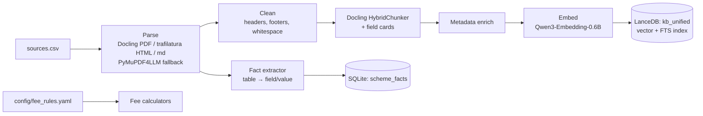
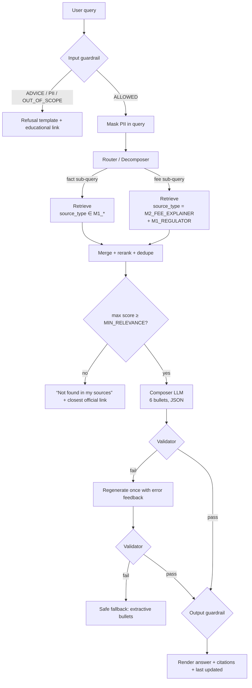

# Pillar A — Smart-Sync Knowledge Base (M1 + M2 RAG)

> Parent: [../architecture.md](../architecture.md) · Rules: [../rules.md](../rules.md) · Evals: [../evals.md](../evals.md)

## 1. Purpose

Answer investor questions that need **both**:
- **Facts** from M1 scheme documents (e.g. *exit load %, lock-in, expense ratio, benchmark, riskometer, min SIP*), and
- **Fee logic** from the M2 Fee Explainer (e.g. *why an exit load / stamp duty / STT was charged, how it is calculated*).

Example: *"What is the exit load for the ELSS fund and why was I charged it?"*
→ exit load value from the ELSS factsheet + explanation of when/why exit loads apply from the fee explainer, in **6 cited bullets**.

---

## 2. Corpus

| Source type (`source_type`) | Origin | Examples | Format |
|-----------------------------|--------|----------|--------|
| `M1_FACTSHEET` | M1 | Monthly factsheet pages per scheme | PDF / HTML |
| `M1_KIM_SID` | M1 | Key Information Memorandum, Scheme Information Document | PDF |
| `M1_REGULATOR` | M1 | AMFI / SEBI investor education pages (exit load, riskometer, ELSS lock-in) | HTML |
| `M2_FEE_EXPLAINER` | M2 | Fee explainer notes: exit load, stamp duty, STT, expense ratio, capital-gains statement basics | Markdown |

**Scope:** 30 funds, Direct plans. Edelweiss Mutual Fund has 5 schemes (ELSS Tax Saver, Large Cap, Flexi Cap, Nifty 50 Index, Liquid), chosen so that fee scenarios differ (e.g. ELSS lock-in vs liquid-fund graded exit load). Bajaj Finserv Mutual Fund has 25 schemes (equity, sectoral, index, hybrid, debt and ETF), taken from its official scheme pages and August 2026 factsheet. Their exit-load rules (including "6 months" windows and free-unit allowances) are in `config/fee_rules.yaml`. A generic alias preceded by another AMC's brand ("SBI Small Cap") is treated as an unsupported scheme. `M1_KIM_SID` is reserved; the AMC site blocks automated fetches, so scheme facts currently come from scheme pages and one AMC factsheet page (see `data/corpus/README.md`).

Every document is registered in `data/sources.csv`:

```csv
doc_id,url,title,scheme,category,source_type,fetched_on,as_of,local_path,fetch_method
F-ELSS-01,https://www.indmoney.com/mutual-funds/edelweiss-elss-tax-saver-direct-plan-growth-option-2669,Edelweiss ELSS Tax Saver Fund Direct Growth (INDmoney scheme page),Edelweiss ELSS Tax Saver Fund,ELSS,M1_FACTSHEET,2026-10-03,2026-08-31,data/corpus/schemes/F-ELSS-01.md,search_capture
R-MFSH-LOADS-01,https://www.mutualfundssahihai.com/en/what-are-loads,AMFI Mutual Funds Sahi Hai: What is exit load,ALL,ALL,M1_REGULATOR,2026-10-03,,data/corpus/raw/R-MFSH-LOADS-01.html,http
FE-EXIT-01,https://www.mutualfundssahihai.com/en/what-are-loads,Fee Explainer: Exit load,ALL,ALL,M2_FEE_EXPLAINER,2026-10-03,2026-10-03,data/corpus/fee_explainer.md#exit-load,internal
```

| Column | Meaning |
|---|---|
| `fetched_on` | Date the copy in `data/corpus/` was taken. Shown to users as "last updated". |
| `as_of` | Date the data itself refers to (e.g. factsheet month, NAV date). Empty for evergreen pages. |
| `local_path` | File ingest reads; `#anchor` selects one `##` section of the fee explainer. |
| `fetch_method` | `http` (`scripts/fetch_corpus.py`), `m1_local` (reused M1 fetch), `search_capture` (site blocks bots; text captured from a search index, original URL kept), `internal` (fee explainer). |

> The M2 Fee Explainer is an internal doc, so its `url` is the public page it was built from (AMFI/SEBI/AMC URL) and `local_path` carries the internal anchor. Users must always see a public link.

---

## 3. Ingestion Pipeline



> Tool choices and alternatives are in [techDecisions.md](../techDecisions.md) §3.

### Structured facts layer (deterministic numbers)
Factsheet tables (exit load, expense ratio, lock-in, minimum SIP, benchmark, riskometer) are also stored as rows so numbers are **looked up, not generated**:

| Column | Example |
|--------|---------|
| `scheme` | `ELSS Tax Saver` |
| `field` | `exit_load` |
| `value` / `unit` | `0` / `%` |
| `conditions` | `Nil; 3-year statutory lock-in` |
| `source_doc_id`, `page`, `url`, `as_of` | `F-ELSS-01`, `2`, `https://...`, `2026-09-30` |

- FACT sub-queries hit `scheme_facts` first; the matching chunk is still retrieved so the citation points at the source text.
- Every extracted row is checked by a human once (spot-check against the PDF) before the demo.
- `fee_rules.yaml` holds rule definitions (e.g. stamp duty `0.005%` of purchase amount, exit-load windows). Calculators in `facts.py` produce the **worked example** (bullet 4) so arithmetic is never done by the LLM.

### Chunking strategy
| Doc type | Strategy | Size |
|----------|----------|------|
| Factsheet | Docling HybridChunker (structure + token aware) plus one **field card** per labelled field (Exit Load, Expense Ratio, Benchmark, Lock-in, Min Investment, Riskometer). Tables kept as Markdown / `key: value` lines. | 150–400 tokens |
| KIM/SID | Heading-based recursive split | 400 tokens, 60 overlap |
| Regulator pages | Heading-based | 400 tokens, 60 overlap |
| Fee Explainer | One chunk per fee type + scenario | 200–400 tokens |

### Chunk metadata
```json
{
  "chunk_id": "F-ELSS-01#exit_load",
  "doc_id": "F-ELSS-01",
  "source_type": "M1_FACTSHEET",
  "scheme": "ELSS Tax Saver",
  "category": "ELSS",
  "field": "exit_load",
  "fee_type": null,
  "url": "https://...",
  "title": "...",
  "fetched_on": "2026-10-01"
}
```
Fee explainer chunks set `fee_type` ∈ {`exit_load`, `stamp_duty`, `stt`, `expense_ratio`, `capital_gains`, `lock_in`}.

Ingestion is idempotent (`doc_id` + content hash). Re-run with `python -m pillar_a_kb.ingest --rebuild`.

---

## 4. Query Pipeline



### 4.1 Router / Decomposer
LLM call (Pydantic structured output, temperature 0) returning:

```json
{
  "intent": "COMBINED",          // FACT | FEE | COMBINED
  "scheme": "ELSS Tax Saver",    // resolved via alias table; null if unknown
  "sub_queries": [
    {"type": "FACT", "text": "exit load of ELSS Tax Saver fund", "field": "exit_load"},
    {"type": "FEE",  "text": "why exit load is charged on redemption", "fee_type": "exit_load"}
  ]
}
```
- **Scheme alias table** maps colloquial names ("the ELSS fund", "tax saver", "liquid fund") → canonical scheme. If ambiguous (two ELSS schemes), the answer lists both or asks a clarifying question (see [edgeCase.md](../edgeCase.md)).
- Keyword fallback when the LLM router fails: regex on fee keywords (`charged`, `deducted`, `load`, `stamp duty`, `STT`) → FEE; field keywords → FACT.

### 4.2 Hybrid Retrieval
- **FACT sub-queries:** look up `scheme_facts` first (exact scheme + field); then retrieve the supporting chunk for citation.
- LanceDB hybrid search per sub-query: vector (top 8) + full-text (top 8), fused with RRF in the engine, pre-filtered by `source_type` and `scheme`.
- **Cross-encoder rerank (`bge-reranker-v2-m3`, on by default)** of the ~16 candidates → top `TOP_K=5` per sub-query. The reranker score is used for the `MIN_RELEVANCE` threshold (calibrated on the golden set).
- Merge across sub-queries, dedupe by `chunk_id`, keep max 8 chunks in context.
- **Coverage rule:** a COMBINED answer requires ≥ 1 FACT chunk and ≥ 1 FEE chunk above threshold; otherwise answer the covered part and state the other part is not in sources.

### 4.3 Composer — the 6-bullet structure
Fixed bullet slots so answers are consistent and testable:

| # | Bullet | Content |
|---|--------|---------|
| 1 | **Direct answer** | One-line answer to the exact question (the fact). |
| 2 | **Key fact detail** | Exact value/condition from the factsheet (e.g. exit load %, period, lock-in). |
| 3 | **Why / how the fee applies** | Fee logic from the explainer, tied to the user's scenario. |
| 4 | **Worked example / calculation** | Illustrative calculation **computed in code** by the `fee_rules.yaml` calculators and passed to the composer as a pre-filled value; the LLM only phrases it (no user-specific numbers unless the user gave them). |
| 5 | **What to check / next step** | Where to verify (statement, transaction date, factsheet section). |
| 6 | **Source & freshness** | "Source: <title> — <url>; last updated <fetched_on>." |

For pure FACT or pure FEE questions the same 6 slots are used (bullet 3/4 adapt to the available info). Bullets ≤ 30 words each.

**Composer output schema** (Pydantic model, enforced with provider-native structured output; `bullets` has `min_length = max_length = 6`):
```json
{
  "bullets": ["...", "...", "...", "...", "...", "..."],
  "citations": [{"chunk_id": "F-ELSS-01#exit_load", "url": "https://..."}],
  "bullet_citations": [[0], [0], [1], [1], [0,1], [0,1]],
  "confidence": "high"
}
```

**System prompt (summary):**
- Use ONLY the provided context chunks. If something isn't in the context, say "not available in my sources".
- Exactly 6 bullets, each ≤ 30 words, following the slot order.
- Cite chunk_ids for each bullet; never invent URLs.
- No recommendations, return predictions, comparisons of "better" funds, or tax advice beyond stated rules.
- Do not ask for or repeat personal data.

### 4.4 Validator (code, not LLM)
| Check | Rule |
|-------|------|
| Bullet count | `len(bullets) == 6` |
| Bullet length | each ≤ 30 words |
| Citation validity | every cited `chunk_id`/`url` ∈ retrieved set |
| Citation coverage | every bullet has ≥ 1 citation |
| Combined coverage | COMBINED intent → cites ≥ 1 M1 chunk **and** ≥ 1 M2 chunk |
| Number grounding | every % / ₹ / number in bullets appears in a cited chunk, a `scheme_facts` row or the calculator output (regex match) |
| Advice / PII | output guardrail pass; PII scrubber finds nothing |

### 4.5 Rendering
- 6 bullets, then **Sources** chips (title + link), "Last updated from sources: <date>".
- Footer disclaimer: *"Facts only. Not investment advice."*

---

### 4.6 Implementation notes (Phase 3, as built)
Deviations from the design above, and why:

| Area | As built | Reason |
|------|----------|--------|
| Router | **Rules first** (alias table + regex for fields, fee types, holding days, "charged/deducted", open-ended "who/cap/limit/SEBI" wording); LLM router only when `use_llm=True` and a key exists. | Deterministic, offline, testable; the 5 golden questions and edge cases are fully covered by rules. |
| Statuses | `ANSWERED`, `PARTIAL`, `NOT_FOUND`, `CLARIFY` (e.g. "the equity fund" matches 3 schemes), `REFUSED`, `UNAVAILABLE` (index/models missing). | Explicit states make UI and evals simpler than free-text fallbacks. |
| Composer | **Template frames first**, filled from `scheme_facts` + calculators + explainer chunks; optional LLM composer behind the same validator. Frames: combined fact+fee, concept (lists every scheme's value), compare (≤ 3 named schemes, notice names the rest). | Numbers are always code-sourced; answers are reproducible without an API key. |
| Open-ended questions | Questions with no frame (e.g. "Is there a limit on exit load?") use the **extractive** composer: cleaned explainer/regulator sentences, only from chunks with rerank score ≥ max(`extractive_min_score`=0.3, top/2); below 0.3 → `NOT_FOUND`. | Stays strictly within sources, avoids tangential answers. |
| Parsing | Docling used for PDFs without layout/OCR models; HTML/markdown via trafilatura/markdown splitter. | Avoids extra model downloads; the corpus is text-first. |
| Sync | Incremental: per-document content hash; only changed docs are re-embedded ("Sync sources" button). | Fast refresh. |
| Offline | `config/__init__.py` sets `HF_HUB_OFFLINE`, `TRANSFORMERS_OFFLINE`, telemetry off, `LITELLM_LOCAL_MODEL_COST_MAP` before any import; models load from `.models/hf` with `local_files_only`. A test asserts zero outbound sockets during `answer()`. | Privacy; no surprise downloads. |

Measured on G1–G5 (`evals/rag_checks.py`): all PASS, recall@k 1.00, evidence-hit 1.00, ~0.5 s warm latency (~3 s cold).

## 5. Example

**Q:** *What is the exit load for the ELSS fund and why was I charged it?*

**A (illustrative — values must come from the ingested factsheet):**
1. The ELSS Tax Saver fund has **no exit load**, but units are locked in for 3 years from each purchase. [1]
2. Per the factsheet, exit load: *Nil*; lock-in: 3 years per SIP instalment. [1]
3. An exit load is a fee the AMC deducts when units are redeemed before the scheme's stated period; for ELSS the lock-in prevents early redemption instead. [2]
4. If a deduction appeared, it may be stamp duty (0.005% on purchase) or STT on redemption rather than exit load — e.g. ₹10,000 purchase → ₹0.50 stamp duty. [2]
5. Check your transaction statement for the charge label and the redemption date vs. purchase date. [2]
6. Sources: ELSS Factsheet Sep-2026 [1]; Fee Explainer – Exit Load & Charges [2]. Last updated 2026-10-01.

> This example also shows an important edge case: the user's premise ("I was charged exit load") may be false for ELSS. The system corrects the premise using sources instead of inventing a charge.

---

## 6. Interfaces

```python
def answer(query: str, session_id: str) -> KBAnswer: ...

class KBAnswer(BaseModel):
    status: Literal["ANSWERED", "PARTIAL", "NOT_FOUND", "REFUSED"]
    bullets: list[str]            # len 6 when ANSWERED/PARTIAL
    citations: list[Citation]
    intent: Literal["FACT", "FEE", "COMBINED"]
    refusal_reason: str | None
    retrieved_chunk_ids: list[str]  # used by Faithfulness eval
    latency_ms: int
```

`retrieved_chunk_ids` and `citations` are logged so the RAG eval can compute faithfulness offline.

---

## 7. Failure Modes

| Failure | Handling |
|---------|----------|
| Vector store empty / not built | UI banner "Index not built" + rebuild button; no LLM call |
| LLM timeout | 1 retry; then extractive fallback (top chunk sentences into 6 bullets) |
| Validator fails twice | Extractive fallback with citations |
| Conflicting values across docs | Prefer latest `fetched_on` factsheet; mention "as of <date>" |
| Unknown scheme | Ask user to pick from supported scheme list |

More in [../edgeCase.md](../edgeCase.md).
