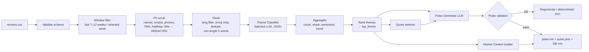

# M2 — Review Pipeline, Theme Classification & Weekly Pulse

> Parent: [../architecture.md](../architecture.md) · Consumers: [voiceagent.md](./voiceagent.md) (top theme) and [mcpIntegration.md](./mcpIntegration.md) (market context)

## 1. Purpose

Turn raw app-store reviews into:
1. A ranked list of **themes** (fixed taxonomy).
2. A one-page **Weekly Pulse** (≤ 250 words, top 3 themes, 3 quotes, **exactly 3 action ideas**).
3. A **`top_theme`** used to brief the Voice Agent (Pillar B).
4. A **Market Context** snippet used in advisor email drafts (Pillar C).

---

## 2. Input — Review CSV

`data/reviews/reviews.csv` (Play Store / App Store export or scraped):

| Column | Required | Notes |
|--------|----------|-------|
| `review_id` | yes | unique |
| `date` | yes | ISO date; used for weekly window |
| `rating` | yes | 1–5 |
| `title` | no | |
| `text` | yes | review body |
| `platform` | no | android / ios |
| `user_name` | no | **always replaced by `[REDACTED]`**; never stored |

Column names are normalised via an alias map (`content`→`text`, `score`→`rating`, `at`→`date`).

---

## 3. Pipeline



---

## 4. Theme Taxonomy (fixed, `config/themes.yaml`)

A fixed list keeps classification stable week-to-week and makes the Voice Agent logic testable. Max **5 active themes** per pulse (others → `Other`).

| Theme | Description / signals | Voice-bookable topic? |
|-------|-----------------------|-----------------------|
| `Login Issues` | OTP not received, app logout, 2FA, password/MPIN, biometric | No → mapped to `Account & App Access` (support info only) |
| `Nominee Updates` | add/change nominee, nomination deadline, nominee verification | **Yes** → `Nominee Updates` |
| `KYC & Onboarding` | KYC pending/rejected, document upload, re-KYC | **Yes** → `KYC/Onboarding` |
| `SIP & Mandates` | SIP failed, mandate/autopay setup, SIP date change | **Yes** → `SIP/Mandates` |
| `Withdrawals & Timelines` | redemption delay, payout not received, settlement | **Yes** → `Withdrawals & Timelines` |
| `Fees & Charges` | exit load, unexpected deduction, charges confusion | **Yes** → `Statements/Tax Docs` (fee explanation) |
| `Statements & Tax Docs` | capital-gains statement, CAS, tax proofs | **Yes** → `Statements/Tax Docs` |
| `App Performance & UX` | crash, slow, bugs, UI complaints | No |
| `Customer Support` | no response, chatbot unhelpful | No |
| `Other` | anything else | No |

The theme → voice topic mapping lives in `themes.yaml` so that Pillar B knows whether it can offer a booking for the top theme (see [voiceagent.md §4](./voiceagent.md)).

---

## 5. Theme Classifier

- **Method:** batched LLM classification (25 reviews/call, Pydantic structured output, temperature 0) with the taxonomy + descriptions + 2 examples per theme in the prompt. The `theme` field is a `Literal[...]` of taxonomy labels, so off-list labels are rejected by the schema.
- **Output per review:**
  ```json
  {"review_id": "r_1021", "theme": "Nominee Updates", "secondary_theme": null, "sentiment": -0.6, "confidence": 0.86}
  ```
- **Fallback:** keyword rules from `themes.yaml` if LLM fails or confidence < 0.5.
- **Validation:** label must be in taxonomy; invalid → `Other`.
- **Cache:** results cached by `review_id` + text hash so re-runs are cheap and deterministic.
- **Quality check:** a hand-labelled sample of 50 reviews is used to report classifier accuracy (target ≥ 80%) in the eval report.
- **Method choice:** zero-shot LLM classification on a fixed taxonomy beats unsupervised topic modelling here because labels must be stable week-to-week and map to voice topics. See [techDecisions.md](../techDecisions.md) §5.1.
- **Theme discovery (offline, optional):** run BERTopic on reviews labelled `Other` to *suggest* new themes. A human decides whether to add them to `themes.yaml`; suggestions never change the live taxonomy automatically.

---

## 6. Ranking → `top_theme`

Score per theme over the selected week:

```
score = 0.6 * share_of_reviews + 0.25 * negativity + 0.15 * week_over_week_growth
negativity = (1 - mean_rating/5)            # or -mean_sentiment normalised to 0..1
```

- `Other` is never eligible to be the `top_theme`.
- Ties broken by raw count, then alphabetical (deterministic).
- `top_theme` is stored in `pulse.json` and in the `pulses` table.
- **Min evidence:** a theme needs ≥ 5 reviews (or ≥ 5% share) to be the top theme; otherwise `top_theme = null` and the voice agent uses the generic greeting.

---

## 7. Weekly Pulse

### 7.1 Structure (≤ 250 words total)
```
# Weekly Product Pulse — <week range>   (Reviews analysed: N)

## Top Themes
1. <Theme> — <share>% of reviews, <sentiment label>
2. ...
3. ...

## What Users Are Saying
- "<quote 1>"
- "<quote 2>"
- "<quote 3>"

## Action Ideas
1. <action idea 1>
2. <action idea 2>
3. <action idea 3>
```

### 7.2 Quote selection
- 1 quote per top-3 theme, chosen from high-confidence, mid-length (10–40 words) reviews.
- Quotes are **already PII-scrubbed**; re-scrubbed after selection; trimmed with "…" if needed.
- Never include usernames; attribution, if any, is `— [REDACTED], ★2`.

### 7.3 Generation + Validator (code-first)
The pulse is **assembled by code from a template**; the LLM is used only for the parts that need language:

| Part | Produced by |
|------|-------------|
| Header, week range, review count | code |
| Top 3 themes with share % and sentiment label | code (from aggregates) |
| Quotes | code (selection rules in §7.2) |
| One-line per-theme summary (optional) | LLM, ≤ 20 words each |
| Action ideas | LLM, Pydantic model `ActionIdeas(ideas: list[str])` with `min_length = max_length = 3` via native structured output |

Code then enforces:

| Rule | Enforcement |
|------|-------------|
| `word_count(pulse_md) ≤ 250` | code budgets words per section; if over, trim summaries → shorten quotes ("…") → drop summaries |
| `len(action_ideas) == 3` | guaranteed by schema; on validation error retry once, else use template ideas per theme |
| Top 3 themes listed | built from aggregates, not LLM |
| No PII | PII scrubber on final text |
| No investment advice | output guardrail |
| Action ideas are product/ops actions | prompt + rubric (e.g. "Add in-app nominee status tracker") |

The validator results (`word_count`, `action_idea_count`) are saved with the pulse and reused by the UX eval.

---

## 8. Market Context Snippet (for Pillar C)

A short, advisor-facing sentiment summary (≤ 60 words, neutral tone, no PII, no advice), generated from aggregates — **template first, LLM polish optional**:

```
Market Context (Pulse PULSE-2026-W40, 27 Sep–3 Oct): Top customer theme is
"Nominee Updates" (23% of 412 reviews, mostly negative — confusion about
verification status). Also rising: Login Issues (20%) and Withdrawal Delays (13%).
Expect questions on these topics.
```

If the booking topic matches one of the top 3 themes, add one line: *"This caller's topic matches a current top theme."*

---

## 9. Outputs

| Output | Location | Consumer |
|--------|----------|----------|
| `pulse.md` | `data/artifacts/pulse_<id>.md` + Pulse tab | Humans |
| `pulse.json` | `data/artifacts/pulse_<id>.json` | Voice Agent, Approval Center, Evals |
| `pulses` row | SQLite | Voice Agent (`get_latest_pulse()`), Overview tab |
| Notes doc entry | `notes.md` / Google Doc "Weekly Pulse" section | Ops (pulse summary is appended once per pulse) |
| Classified reviews | `data/artifacts/classified_<id>.csv` (scrubbed) | Debugging, classifier eval |

---

## 10. Interfaces

```python
def run_pulse(csv_path: str, week: date | None = None) -> Pulse: ...
def get_latest_pulse() -> Pulse | None: ...
def build_market_context(pulse: Pulse, booking_topic: str | None) -> str: ...
```

## 11. As-built notes (Phase 4)

| Area | As built | Why |
|------|----------|-----|
| Classifier | Keyword rules (word-bounded, plural/verb suffixes) are the **default**; the batched LLM classifier (`Literal` labels, JSON cache keyed by taxonomy version + text) runs only when `PULSE_LLM_ENABLED=true` and a key is set. LLM results below 0.5 confidence fall back to keywords. | Deterministic, offline and free by default; LLM is an opt-in upgrade. |
| Accuracy | 86% on the hand-labelled 50-review sample (`uv run python -m evals.classifier_accuracy`). | The keyword lists were tuned using this same sample, so this figure is optimistic; re-label a fresh sample before relying on it. |
| Ranking | `score = 0.6·theme_share + 0.25·negativity + 0.15·growth`, where `theme_share` is the share of **non-Other** reviews. Eligible = not Other, count ≥ 5 and theme_share ≥ 5%. | Share of all reviews let a large `Other` bucket flatten the signal; the minimum count stops a 3-review theme from winning on negativity alone. |
| Pulse copy | Code template by default (per-theme `action_idea` from `themes.yaml`, generic ideas to fill up to 3). LLM copy (opt-in) is schema-enforced (exactly 3 ideas ≤ 25 words) and rejected if it trips the output guard or contains `[REDACTED]`. | The rubric (≤ 250 words, exactly 3 ideas) must never depend on model behaviour. |
| Budget | Trim order: drop summaries → shorten quotes (40→10 words) → shorten ideas. | Keeps the structure intact. |
| Persistence | `pulses` row, `pulse_<id>.md/.json`, `classified_<id>.csv`, and an idempotent `[PULSE-…]` entry in `notes.md`. | `get_latest_pulse()` feeds Pillars B and C. |
| Full dataset | 3,218 reviews after cleaning; top theme **App Performance & UX** (not bookable → Voice Agent uses the "non-bookable" greeting). | — |
