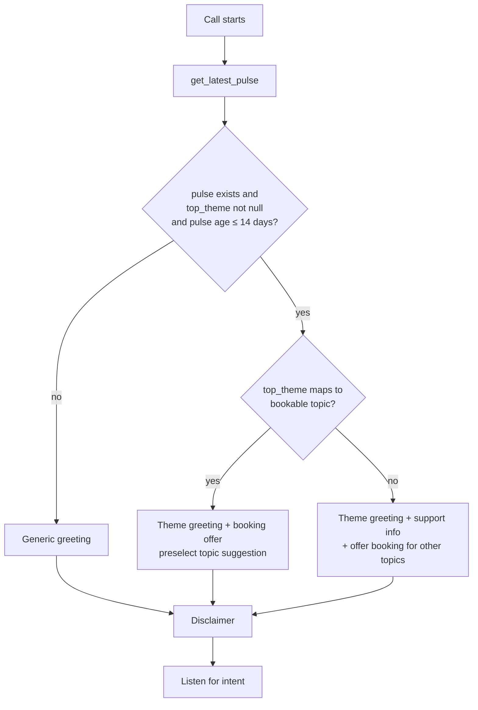
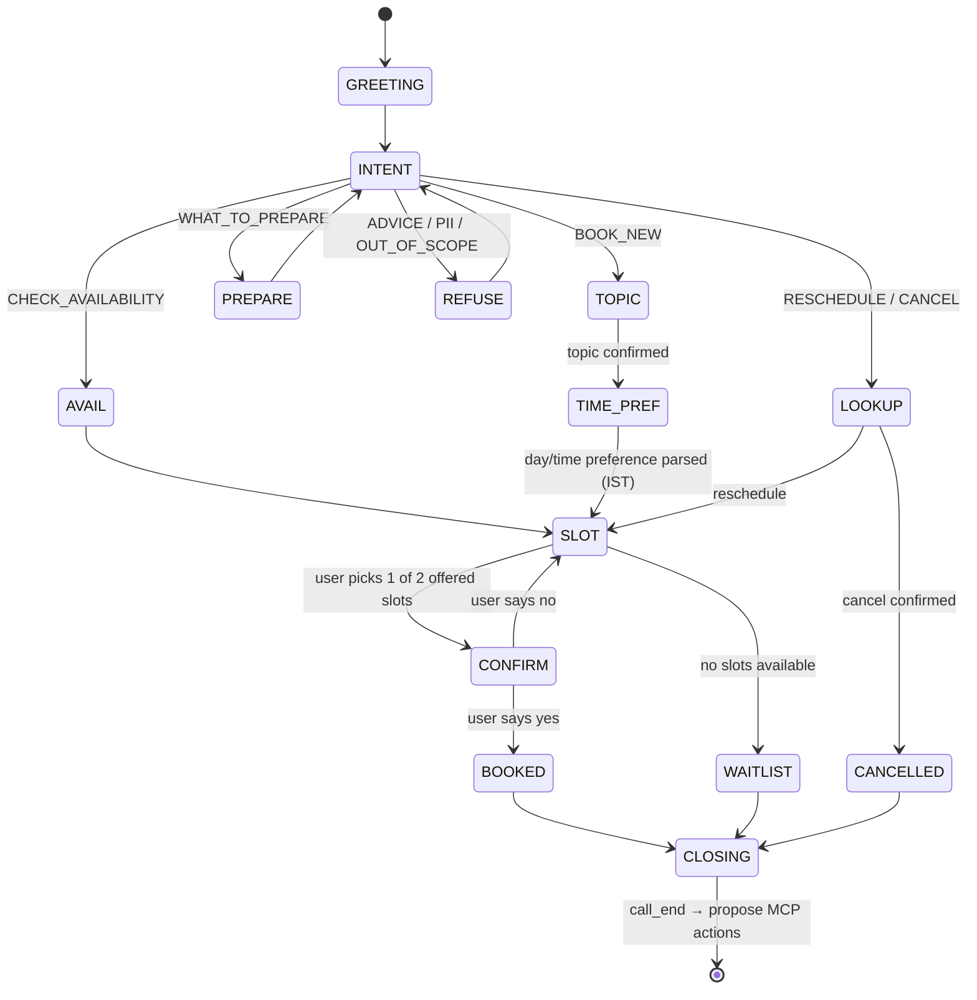
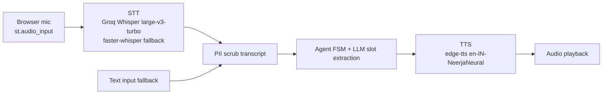

# Pillar B — Theme-Aware Voice Agent (M3)

> Parent: [../architecture.md](../architecture.md) · Input: [themeClassification.md](./themeClassification.md) · Output: [mcpIntegration.md](./mcpIntegration.md)

## 1. Purpose

A voice (or text-fallback) agent that books **tentative advisor appointments** for a fixed set of topics. It is now **theme-aware**: at the start of each call it reads the latest Weekly Pulse and proactively mentions the top theme in its greeting.

The agent **never** collects PII on the call and **never** gives investment advice.

---

## 2. Supported Intents

| Intent | Example utterance | Outcome |
|--------|-------------------|---------|
| `BOOK_NEW` | "I want to talk to an advisor about my nominee." | Topic → slot → confirm → Booking Code |
| `RESCHEDULE` | "Move my booking NL-A742 to Friday." | Lookup by code → new slot → update actions |
| `CANCEL` | "Cancel NL-A742." | Status `CANCELLED` → cancellation actions proposed |
| `WHAT_TO_PREPARE` | "What should I keep ready?" | Topic-specific checklist (no PII collected) |
| `CHECK_AVAILABILITY` | "What slots do you have tomorrow?" | List up to 2 slots in IST |
| `FAQ_QUESTION` | "What is the exit load of the liquid fund?" | Short answer via Pillar A (≤ 2 sentences + "link shared in notes") or redirect to Unified Search |
| `ADVICE / PII / OUT_OF_SCOPE` | "Which fund gives 20%?" | Polite refusal + offer booking |

**Booking topics** (fixed): `KYC/Onboarding`, `SIP/Mandates`, `Statements/Tax Docs`, `Withdrawals & Timelines`, `Nominee Updates`, `Account & App Access`.

---

## 3. Theme-Aware Greeting

### 3.1 Logic


### 3.2 Templates (deterministic — guarantees the theme is mentioned)
The greeting is built from **templates**, with the LLM used only for optional paraphrasing that is re-validated to still contain the theme phrase.

| Case | Template |
|------|----------|
| Bookable top theme | "Hi, welcome to the Advisor Desk. I see many users are asking about **{theme}** today — I can help you book a call for that! Or tell me what else you need." |
| Non-bookable top theme (e.g. Login Issues) | "Hi, welcome to the Advisor Desk. I see many users are facing **{theme}** today — our support team is on it, and you can find help steps in the app's Help section. I can book an advisor call for KYC, SIPs, statements, withdrawals or nominee updates." |
| No / stale pulse | "Hi, welcome to the Advisor Desk. I can help you book a call with an advisor for KYC, SIPs, statements, withdrawals or nominee updates." |

Always followed by the **disclaimer**: *"Quick note: I share information only, not investment advice, and please don't share personal details like your phone number or PAN on this call."*

### 3.3 Traceability
Each booking stores `pulse_id` and `greeting_theme`, so the UX eval and the Notes doc can prove which theme briefed the call.

---

## 4. Dialog State Machine



- **Slot offering:** read availability (mock calendar JSON or Google free/busy); offer **exactly 2** slots, always in **IST**, spoken as "Monday 6 October, 3:00 PM IST".
- **Max turns:** 3 failed parses in a state → offer text fallback / end with "please try the app".
- **Topic suggestion:** if greeting mentioned a bookable top theme and the user says "yes, that", topic = mapped topic.

---

## 5. Booking Code

- Format: `NL-` + 1 uppercase letter (excluding I, O) + 3 digits → e.g. `NL-A742`.
- Generated with a cryptographically random source; uniqueness checked against `bookings` table (retry on collision).
- Read back to the user character by character: "N L dash A 7 4 2".
- The code is the **only** identifier for the booking — no names, phone numbers or emails.

---

## 6. Closing Script

> "You're booked for a tentative **{topic}** call on **{date}, {time} IST**. Your booking code is **{code}**. An advisor will confirm shortly. To share contact details securely, please use the link in the app with your booking code — don't share them on this call. Anything else?"

On `call_end` the agent writes `booking.json` and calls `actions.propose_for_booking(code)` → pending items in the Approval Center (see [mcpIntegration.md](./mcpIntegration.md)).

---

## 7. Audio Layer



- **Turn-based push-to-talk** is the chosen interaction model: deterministic, easy to evaluate and fits Streamlit. A real-time streaming pipeline (Pipecat with VAD and barge-in) is a stretch goal. Speech-to-speech models are avoided for this flow because the scripted disclaimer, refusals and booking-code read-back must be exact. See [techDecisions.md](../techDecisions.md) §6.1–6.2.
- **Text-mode** is first-class: the same agent runs on typed input (used by evals and for demos without a mic).
- Transcripts are scrubbed **before** storage or LLM calls; raw audio is not persisted.
- NLU = LLM structured extraction (Pydantic) `{intent, topic, date_pref, time_pref, booking_code, yes_no}` on a low-latency model + `dateparser` with `ZoneInfo("Asia/Kolkata")` for relative dates ("tomorrow evening").
- The booking code is read back character by character in TTS ("N L dash K 4 7 2").

---

## 8. Guardrails on the Call

| Situation | Response |
|-----------|----------|
| Investment advice ("which fund is best?") | "I can't give investment advice. I can share factual info or book you a call with an advisor." |
| User shares PII ("my PAN is ABCDE1234F") | Mask in transcript; "Please don't share personal details here — I've not stored it. Use the secure link with your booking code." |
| Asks for PII (CEO email, advisor phone) | Refuse; point to official public support channels. |
| Out of scope (weather, stock tips) | Brief refusal + restate what the agent can do. |

---

## 9. Interfaces

```python
class VoiceSession:
    def start(self) -> AgentTurn                      # builds theme-aware greeting
    def handle(self, user_text: str) -> AgentTurn     # one dialog turn
    def end(self) -> BookingResult | None             # writes booking + proposes actions

class AgentTurn(BaseModel):
    text: str
    audio_path: str | None
    state: str
    booking_code: str | None
    greeting_theme: str | None
```

The UX eval calls `VoiceSession().start()` directly and checks that `greeting_theme == pulse.top_theme` **and** the theme string appears in `text`.

---

## 10. As-built notes (Phase 5)

- **Rules-first NLU.** Intents, yes/no, slot choice, booking codes and IST day/part/time preferences are parsed with rules (`nlu.py`, `when.py`). The LLM extractor (`prompts/voice_nlu.v1.md`, `LLM_VOICE_NLU`) runs only when `VOICE_LLM_ENABLED=true`, a key is set **and** the rules found no signal. Its output is schema-checked (`LLMExtraction`), and failures fall back to the rules result.
- **Per-turn guard is rules-only.** `check_input(use_llm=False)` would mark short replies such as "Monday 3 pm" as out of scope, so the agent blocks only `ADVICE`, `PII_REQUEST` and prompt-injection. Shared PII is masked before the text reaches the NLU or the transcript, and a notice is prefixed to the reply.
- **Login Issues is bookable.** `config/themes.yaml` maps Login Issues → *Account & App Access* (one of the 6 topics), so the login fixture gets the bookable template, not the non-bookable one shown in §3.2. The theme is still named in the greeting, so U2 passes. Non-bookable themes (e.g. *App Performance & UX*, the top theme of the full review set) use the non-bookable template.
- **Staleness** is measured from the pulse `created_at` (falling back to `week_end`).
- **Slots:** `offer()` returns ≤ 2 slots from `data/availability.json`, skipping slots < 1 h away and slots held by active bookings. If the requested day/part has none, it falls back to later days and says so. An empty calendar → waitlist message and the call ends.
- **Reschedule** keeps the booking code (status `RESCHEDULED`, old slot recorded in the audit log); **cancel** sets `CANCELLED` and frees the slot.
- **Hand-off:** `end()` writes `data/artifacts/bookings/<code>.json` (PII-scrubbed) and calls `on_end` once per result (default `pillar_c_mcp.actions.propose_for_booking`). A failing hook is logged and never loses the booking.
- **Speech:** `AgentTurn.speech` spells booking codes out ("N L dash A 7 4 2") for TTS; `text` keeps the code as typed.
- **Three failed parses** in the same state end the call politely.

