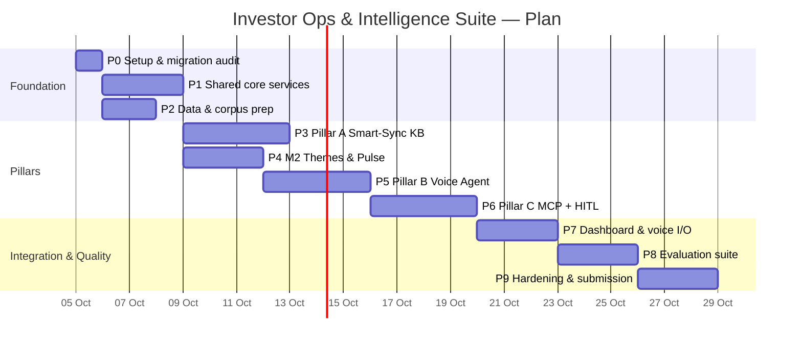
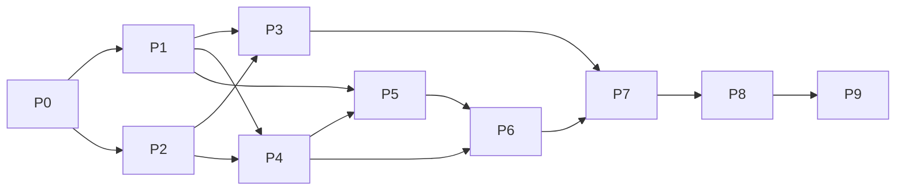

# Development Plan — Phase-wise

> How we build the Investor Ops & Intelligence Suite from an empty repo to a submitted, evaluated product.
> Design references: [architecture.md](./architecture.md) · [rules.md](./rules.md) · [edgeCase.md](./edgeCase.md) · [evals.md](./evals.md)

---

## 1. Planning Principles

1. **Vertical slices early.** Get one thin end-to-end path (search → answer, call → booking → approval) working before polishing any single pillar.
2. **Reuse M1/M2/M3 code.** Port existing logic into the new module layout; don't rewrite what already works.
3. **Shared core first.** PII scrubbing, guardrails, the LLM client and the state DB are built once, before the pillars, because every pillar depends on them.
4. **Mock adapters by default.** Google integrations are optional extras added after the mock flow passes the evals.
5. **Evals from day one.** Fixtures and golden data are written alongside each pillar. The full eval suite is wired up in Phase 8, but each phase has its own checks before it can be called done.
6. **Every phase ends in a demoable state.** Each phase lists the specific checks that must pass before moving on.

---

## 2. Timeline Overview

Estimate: **~4 weeks** for one developer working part-time (~4–5 h/day). Phases 3, 4 and 5 can partly overlap.

| Phase | Name | Duration | Depends on | Milestone |
|-------|------|----------|------------|-----------|
| 0 | Project setup & migration audit | 1 day | — | Repo runs `streamlit run app.py` (empty shell) |
| 1 | Shared core services | 2–3 days | 0 | PII + guardrail unit tests green |
| 2 | Data & corpus preparation | 2 days | 0 | Corpus + review CSV + fixtures ready |
| 3 | Pillar A — Smart-Sync KB | 4 days | 1, 2 | **M-A:** 6-bullet cited combined answers |
| 4 | M2 — Themes & Weekly Pulse | 3 days | 1, 2 | **M-P:** `pulse.json` with top theme + market context |
| 5 | Pillar B — Theme-Aware Voice Agent | 4 days | 1, 4 | **M-B:** theme greeting + booking code (text mode) |
| 6 | Pillar C — MCP + HITL Approval Center | 4 days | 1, 4, 5 | **M-C:** approved actions → notes/calendar/email with code + market context |
| 7 | Integrated dashboard & voice I/O | 2–3 days | 3, 4, 5, 6 | **M-UI:** all pillars in one app |
| 8 | Evaluation suite | 3 days | 3–7 | **M-E:** eval report, Safety 100% |
| 9 | Hardening, docs, demo & submission | 2–3 days | 8 | **Final submission** |

---

## 3. Phases in Detail

### Phase 0 — Project Setup & Migration Audit (1 day)

**Goal:** A clean repo skeleton plus a clear inventory of what can be reused from M1/M2/M3.

| ID | Task |
|----|------|
| 0.1 | Init git repo, `.gitignore` (`.env`, `data/artifacts/`, `data/lancedb/`, `*.db`, tokens), `README.md`. |
| 0.2 | Create the folder layout from [architecture.md §4](./architecture.md#4-proposed-repository-layout). |
| 0.3 | `uv init` (Python 3.11+); `uv add` streamlit, litellm, pydantic, pydantic-settings, sqlmodel, docling, trafilatura, pymupdf4llm, lancedb, sentence-transformers, presidio-analyzer, presidio-anonymizer, pandas, fastmcp (>=4.0,<5, as installed in M3), google-api-python-client, google-auth, google-auth-oauthlib, dateparser, groq, edge-tts, arize-phoenix, openinference-instrumentation-litellm; dev: pytest, deepeval, ruff, pre-commit, detect-secrets. Commit `uv.lock`. Choices: [techDecisions.md](./techDecisions.md). |
| 0.4 | `config/settings.py` + `.env.example` with all keys from [architecture.md §10](./architecture.md#10-configuration-env--settingspy). Pre-commit hooks: ruff, detect-secrets. |
| 0.5 | **Migration audit:** list the M1/M2/M3 notebooks/scripts → map each function to its new module (table in `README`). Mark each one *port as-is*, *refactor*, or *rewrite*. M3's `mcp_server/`, `mcp_client/` (`client.py`, `tool_gate.py`, `outbox.py`, `executor.py`) and `domain/plan.py` are *port as-is + extend* (see [mcpIntegration.md §2.1](./architecture/mcpIntegration.md)). |
| 0.6 | Empty Streamlit app with 7 placeholder tabs. |

**Deliverables:** skeleton repo, migration map, running empty app.
**Exit criteria:** `uv sync && uv run streamlit run app.py` works; `uv run pytest` runs (0 tests OK).

---

### Phase 1 — Shared Core Services (2–3 days)

**Goal:** The services every pillar depends on. **Rules:** P1–P7, C1–C3, L1–L6, E5, E9.

| ID | Task |
|----|------|
| 1.1 | `core/pii.py`: Microsoft Presidio analyzer + anonymizer with built-in `IN_PAN`, `IN_AADHAAR`, `PHONE_NUMBER` (IN), `EMAIL_ADDRESS`, `CREDIT_CARD`; custom recognizers for folio/account and UPI IDs; spaCy `en_core_web_lg` for PERSON → `[REDACTED]`. |
| 1.2 | `core/guardrails.py`: rule-based fast path (advice/returns/compare/PII-request keywords) plus an LLM intent classifier (Pydantic structured output) → `ALLOWED / ADVICE / PII_REQUEST / PII_SHARED / OUT_OF_SCOPE`; refusal templates from [rules.md §9](./rules.md#9-standard-refusal-templates). |
| 1.3 | `core/llm.py`: thin wrapper over LiteLLM (Gemini Flash primary, Groq fallback), Pydantic structured output with one validation retry, timeout, token/cost logging; Phoenix tracing with PII-scrubbed spans. |
| 1.4 | `core/state.py`: SQLite schema from [architecture.md §7](./architecture.md#7-data-model-sqlite), WAL mode, repository functions. |
| 1.5 | `core/logging.py`: structured JSON logs; all messages pass through the PII scrubber. |
| 1.6 | Prompt folder `prompts/` with versioned prompt files. |
| 1.7 | Unit tests: PII (≥ 20 cases, including spaced Aadhaar, lowercase PAN, Hinglish text), guardrails (≥ 15 cases, including S1–S7 from evals), state CRUD. |

**Deliverables:** `core/` package + tests.
**Exit criteria:** all core unit tests green; guardrail classifies S1–S7 correctly; no raw PII in a sample log.

---

### Phase 2 — Data & Corpus Preparation (2 days, parallel with Phase 1)

**Goal:** All input data ready and registered.

| ID | Task |
|----|------|
| 2.1 | Choose 1 AMC and 4–5 schemes (ELSS, Large Cap, Flexi Cap, Index, Liquid). Download factsheets, KIM/SID, and AMFI/SEBI pages → `data/corpus/`. |
| 2.2 | Port the M2 Fee Explainer into `data/corpus/fee_explainer.md` with one section per fee type (exit load, graded exit load, stamp duty, STT, expense ratio, lock-in, capital-gains statement), each with a public reference URL. |
| 2.3 | Fill in `data/sources.csv` (doc_id, url, title, scheme, category, source_type, fetched_on). |
| 2.4 | Build the scheme alias table (`config/scheme_aliases.yaml`) and `config/fee_rules.yaml` (exit-load windows, graded slabs, stamp duty rate, STT rate) with a source URL per rule. |
| 2.5 | Port/collect the M2 reviews CSV → `data/reviews/reviews.csv`; normalise columns. |
| 2.6 | Write `config/themes.yaml` (taxonomy, descriptions, keywords, theme → voice topic map). |
| 2.7 | Create synthetic, PII-free eval fixtures: `reviews_fixture_nominee.csv`, `reviews_fixture_login.csv`, `reviews_fixture_empty.csv`. |
| 2.8 | Draft `evals/golden_dataset.json` (G1–G5) and **verify the expected facts against the downloaded factsheets**. |
| 2.9 | Mock availability calendar `data/availability.json` (next 10 working days, IST). |

**Deliverables:** corpus, sources registry, reviews CSV, taxonomy, fixtures, golden dataset draft.
**Exit criteria:** every golden question's expected fact can be found manually in the corpus.

---

### Phase 3 — Pillar A: Smart-Sync Knowledge Base (4 days)

**Goal:** Combined fact + fee answers in 6 cited bullets. **Ref:** [rag.md](./architecture/rag.md). **Rules:** A1–A8.

| ID | Task |
|----|------|
| 3.1 | `ingest.py`: Docling (PDF) / trafilatura (HTML) / markdown parsing, Docling HybridChunker + field cards, metadata, Qwen3-Embedding-0.6B, idempotent upsert into LanceDB `kb_unified` with a full-text index. |
| 3.1b | `facts.py`: extract factsheet tables into the `scheme_facts` table (human spot-check every row); fee calculators driven by `fee_rules.yaml`. |
| 3.2 | `retriever.py`: `scheme_facts` lookup for FACT sub-queries; LanceDB hybrid search (vector + FTS, RRF) with `source_type`/`scheme` pre-filters; bge-reranker-v2-m3 rerank; threshold calibrated on the golden set. |
| 3.3 | `router.py`: LLM decomposition into FACT / FEE / COMBINED sub-queries, plus a keyword fallback and scheme alias resolution. |
| 3.4 | `composer.py`: 6-slot prompt, Pydantic output with per-bullet citations; bullet 4 filled from calculator output. |
| 3.5 | Validator: bullet count/length, citation validity/coverage, M1+M2 coverage for COMBINED, number grounding; regenerate once → extractive fallback. |
| 3.6 | Input and output guardrail integration; PII masking of queries. |
| 3.7 | `answer()` API returning `KBAnswer` (with `retrieved_chunk_ids` for evals). |
| 3.8 | Streamlit "Unified Search" tab: chat, example questions, bullets, source chips, last-updated date, disclaimer. |
| 3.9 | Tests: validator unit tests; manual run of G1–G5; edge cases A-02, A-04, A-05, A-09. |

**Deliverables:** working Unified Search tab.
**Exit criteria (M-A):** G1–G5 each return 6 bullets citing both an M1 and an M2 source; A-02 (ELSS false premise) is corrected; S1 is refused.
**Status:** ✅ met — see `tests/pillar_a/test_integration.py` and `evals/reports/rag_checks.md`. As-built deviations (rules-first router, template-first composer) are in [rag.md §4.6](./architecture/rag.md).

---

### Phase 4 — M2: Theme Classification & Weekly Pulse (3 days)

**Goal:** `pulse.json` with a deterministic top theme and a Market Context snippet. **Ref:** [themeClassification.md](./architecture/themeClassification.md). **Rules:** M1–M7.

| ID | Task |
|----|------|
| 4.1 | `reviews.py`: schema validation, column aliases, week window, PII scrub, dedupe, min-length filter. |
| 4.2 | `classifier.py`: batched LLM classification (Pydantic, `Literal` theme labels) against the taxonomy; keyword fallback; cache by text hash. *(Optional)* offline BERTopic on `Other` to suggest new themes. |
| 4.3 | Aggregation + deterministic ranking (score formula, tie-breaks, `Other` excluded, minimum-evidence rule). |
| 4.4 | Quote selector (one per top-3 theme, PII re-scrub). |
| 4.5 | `pulse.py`: code-first template (header, themes, quotes from aggregates); LLM writes only short theme summaries and exactly 3 action ideas (schema-enforced); word-budget trimming keeps ≤ 250 words. |
| 4.6 | `market_context.py`: template-based snippet (≤ 60 words) plus a "topic matches top theme" line. |
| 4.7 | Persist: `pulses` table, `pulse_<id>.md/.json`, append the pulse summary to the notes doc. |
| 4.8 | Streamlit "Review Pulse" tab: upload, generate, theme bar chart, pulse preview, word-count and idea-count badges. |
| 4.9 | Hand-label 50 reviews → measure classifier accuracy (target ≥ 80%). |

**Deliverables:** Pulse tab + `get_latest_pulse()` API.
**Exit criteria (M-P):** the nominee fixture → `top_theme = "Nominee Updates"`; the login fixture → `"Login Issues"`; the pulse passes the word and idea checks; no PII in quotes.

**Status:** ✅ met — see `tests/pillar_m2/` and `evals/reports/classifier_accuracy.md` (keyword path 86% on the 50-review sample). As-built notes (opt-in LLM, share-of-themed scoring, stricter eligibility) are in [themeClassification.md §10](./architecture/themeClassification.md).

---

### Phase 5 — Pillar B: Theme-Aware Voice Agent (4 days)

**Goal:** A booking agent whose greeting reflects the latest pulse. Text mode first, then audio. **Ref:** [voiceagent.md](./architecture/voiceagent.md). **Rules:** V1–V7.

| ID | Task |
|----|------|
| 5.1 | Port the M3 dialog logic into `agent.py` as an explicit state machine (states from voiceagent.md §4). |
| 5.2 | `greeting.py`: template-based theme-aware greeting (bookable / non-bookable / generic) plus disclaimer; store `greeting_theme` and `pulse_id`. |
| 5.3 | NLU: LLM structured extraction on a low-latency model (intent, topic, date/time preference, code, yes/no) plus `dateparser` with `ZoneInfo("Asia/Kolkata")`. |
| 5.4 | `slots.py`: read availability, offer exactly 2 IST slots, waitlist path. |
| 5.5 | `booking.py`: `NL-[A-HJ-NP-Z]\d{3}` generator with collision check; read-back formatting. |
| 5.6 | Reschedule / cancel / what-to-prepare flows. |
| 5.7 | Guardrail and PII handling per turn (mask transcript, refusals). |
| 5.8 | `end()` → write booking + `booking.json` → hook for Phase 6 (`propose_for_booking`). |
| 5.9 | Tests: greeting for U1–U3 fixtures; full scripted booking in text mode; V-05, V-06, V-08, V-13. |

**Deliverables:** `VoiceSession` API working in text mode.
**Exit criteria (M-B):** the greeting names the top theme for the U1/U2 fixtures; a scripted call produces a valid booking code stored in SQLite with `pulse_id`.

**Status:** ✅ met — see `tests/pillar_b/` (72 tests). As-built notes are in [voiceagent.md §10](./architecture/voiceagent.md).

---

### Phase 6 — Pillar C: MCP Server + HITL Approval Center (4 days)

**Goal:** Every side effect goes through approval; the booking code and Market Context appear in all outputs. **Ref:** [mcpIntegration.md](./architecture/mcpIntegration.md). **Rules:** H1–H9.

| ID | Task |
|----|------|
| 6.1 | `pillar_c_mcp/server.py`: **port M3's FastMCP server** (`fastmcp>=4.0,<5`, `build_server(calendar, docs, gmail)`) with the 5 tools `calendar_list_busy`, `calendar_create_hold`, `calendar_delete_hold`, `docs_append_prebooking`, `gmail_create_draft`. Extend for the 6 capstone topics plus `pulse_id`, `call_summary` and `market_context`; keep `_check_no_pii` and `ToolError("retryable:/permanent:")`. |
| 6.2 | `pillar_c_mcp/local/`: local backends with the same interface as M3's Google wrappers (`.ics` holds, append-only `notes.md` table, `.eml` drafts) with call counters for tests. Inject them via `ADAPTER_MODE=mock`. |
| 6.3 | `plan.py` (port M3 BookingPlan / ReschedulePlan / CancelPlan) and `actions.py`: build the 3 proposed actions from `booking.json` plus the latest pulse (email template with Market Context, calendar title with code). |
| 6.4 | `approval.py` + `outbox.py` (port M3 outbox): state machine PENDING → APPROVED/REJECTED → EXECUTED/RETRYING/FAILED; idempotency key `{code}:{tool}:{version}`; ordering; backoff 5 s/15 s/60 s/5 m/15 m; compensation; audit log; automatic pre-checks (PII, Market Context, booking code, slot still free via `calendar_list_busy`). |
| 6.5 | `client.py` + `tool_gate.py` + `runner.py` (port M3 `ToolClient`, `ToolGate`, `GatedToolRunner`). `MCP_SERVER_TARGET` = `inprocess` (default), a stdio path or an HTTP URL; allow-list discovery fails if any send tool is exposed. |
| 6.6 | Streamlit "Approval Center" tab: queue grouped by booking code, previews, safe editing (read-only code/slot/topic), approve/reject/retry, audit trail. |
| 6.7 | Streamlit "Notes / Doc" tab rendering `notes.md` (booking codes visible). |
| 6.8 | *(Recommended for demo)* `pillar_c_mcp/google/`: reuse M3's Google Calendar / Docs / Gmail wrappers and OAuth helper behind `ADAPTER_MODE=google`. Fail fast on missing config. |
| 6.9 | Tests: port M3's `test_mcp_server.py` contract test (`Client(build_server(...))`: tool list = 5, no send tool), ToolGate tests, HITL gate (0 backend calls while pending), idempotency, H-02, H-03, H-07, H-11. |

**Deliverables:** working approval workflow with mock outputs.
**Exit criteria (M-C):** after a scripted call and "approve all", `notes.md`, the `.ics` and the `.eml` all contain the same booking code; the email contains Market Context with the top theme.

**Status:** ✅ met — see `tests/pillar_c/` (37 tests, including `test_voice_call_to_approved_artifacts_share_code_and_pulse`). `approval.py`/`outbox.py`/`runner.py` were merged into `actions.py`. As-built notes are in [mcpIntegration.md §11](./architecture/mcpIntegration.md).

---

### Phase 7 — Integrated Dashboard & Voice I/O (2–3 days)

**Goal:** One app, all pillars, smooth demo flow. **Rules:** E1, V7.

| ID | Task |
|----|------|
| 7.1 | Overview tab: latest pulse/top theme, pending approvals, last eval status, health checks (index built, LLM reachable, MCP online). |
| 7.2 | Voice tab: briefing banner (current theme), mic input (`st.audio_input`) → Groq Whisper large-v3-turbo STT → agent → edge-tts `en-IN` playback; text fallback; live transcript; booking code card. |
| 7.3 | Sidebar: active Pulse ID, adapter mode, global disclaimer. |
| 7.4 | Cross-tab navigation: booking card → "Open in Approval Center"; Approval Center → Notes. |
| 7.5 | Session-state handling (Streamlit reruns), `st.cache_resource` for models (embedder, reranker, Presidio) and the LanceDB connection. |
| 7.6 | Graceful degradation: missing keys/LLM down/MCP offline banners (X-01, X-02, H-12). |
| 7.7 | UI polish: consistent layout, empty states, loading spinners, error messages. |

**Deliverables:** complete single-entry-point app.
**Exit criteria (M-UI):** a full demo runs in one app without leaving it: Generate Pulse → Search G1 → Voice call (theme greeting) → Approve → see the code in Notes.

**Status:** ✅ met — `tests/dashboard/test_dashboard.py::test_full_demo_flow_in_one_app` drives Pulse → Voice → Approve all → Notes in one AppTest. STT/TTS are built but opt-in (external calls). Streamlit cannot switch tabs programmatically, so 7.4 pre-selects the booking code in the Approval Center and tells the user which tab to open.

---

### Phase 8 — Evaluation Suite (3 days)

**Goal:** Prove the product works. **Ref:** [evals.md](./evals.md).

| ID | Task |
|----|------|
| 8.1 | DeepEval setup (`LLM_JUDGE` ≠ generator); G-Eval rubrics (`relevance_scenario.md`, `pulse_tone.md`, `refusal_quality.md`). |
| 8.2 | **Eval 1 — RAG:** DeepEval Faithfulness + Answer Relevancy + contextual precision/recall; code checks (citations ⊆ retrieved, number grounding, 6 bullets, source coverage, recall@k). |
| 8.3 | **Eval 2 — Safety:** S1–S3 (+ S4–S7) against both Unified Search and the Voice Agent; pass rules 1–5 including DB/log PII checks. |
| 8.4 | **Eval 3 — UX:** pulse rubric (word count, 3 ideas, themes, quotes, PII, tone judge) plus the voice theme logic check for U1–U3. |
| 8.5 | **Eval 4 — Integration:** scripted booking → HITL gate → execution → state persistence → Market Context → idempotency. |
| 8.6 | `run_evals.py`: one command (`uv run python -m evals.run_evals`) wrapping pytest; markdown + JSON report with run config and Phoenix trace links for failures. *(Optional)* Promptfoo red-team pass. |
| 8.7 | Evals tab: run button, results table, badges, report download. |
| 8.8 | **Baseline run** → record failures → fix → re-run (keep both reports). |
| 8.9 | Hand-verify 10% of judge decisions; note agreement in the report. |

**Deliverables:** `evals/reports/eval_report_baseline.md` and `eval_report_final.md`.
**Exit criteria (M-E):** Faithfulness ≥ 0.90, Relevance ≥ 0.80, Safety 100%, Pulse ≤ 250 words with exactly 3 ideas, Voice logic 3/3, Integration all pass.

**Status:** ✅ met — `uv run python -m evals.run_evals` → 4/4 suites pass (`evals/reports/eval_report_latest.md`); the baseline (`eval_report_baseline.md`, Integration 5/7) and its fixes are in [evals.md §8](./evals.md#8-results--baseline--final). As-built: plain-Python suites instead of DeepEval, deterministic proxies by default with an opt-in LLM judge (`EVAL_LLM_JUDGE`); no Phoenix links or Promptfoo pass ([evals.md §7](./evals.md#7-files-as-built)).

---

### Phase 9 — Hardening, Documentation, Demo & Submission (2–3 days)

| ID | Task |
|----|------|
| 9.1 | Walk through every case in [edgeCase.md](./edgeCase.md); tick off tested cases and fix gaps. |
| 9.2 | PII sweep: grep `data/`, logs and the DB for PII patterns → must be 0. |
| 9.3 | Performance check: Unified Search p50 < 4 s; cache embeddings/model loads. |
| 9.4 | Update the docs with any design changes; add a "How to run" and "Demo script" section to the README. |
| 9.5 | Record the demo video (≈ 5 min): Pulse → Theme-aware call → Approval → Notes with booking code → Unified Search G1 → adversarial refusal → eval report. |
| 9.6 | Write the final summary: architecture diagram, eval results table, baseline-vs-final improvements, known limitations. |
| 9.7 | Clean install test on a fresh venv using only README steps. |

**Deliverables:** final repo, eval report, demo video, write-up.
**Exit criteria:** every checkbox in [problemStatement.md §5](./problemStatement.md#5-success-criteria-definition-of-done) is ticked.

**Status:** ✅ met (except the video) — 9.1 edge-case coverage in [edgeCase.md §6](./edgeCase.md#6-coverage-after-phase-91-as-built) + `tests/edge/`; 9.2 `scripts/pii_sweep.py` (0 PII in free text; 60 identifier hits triaged, not suppressed); 9.3 `scripts/latency_check.py` (warm p50 ≈ 0.5 s, cold ≈ 3.7 s); 9.4 README "How to run" + "Demo script"; 9.5 video not recorded — the demo script replaces it; 9.6 [finalSummary.md](./finalSummary.md); 9.7 fresh-venv install → 457 tests, 4/4 evals, app healthy ([finalSummary.md §6](./finalSummary.md#6-clean-install-check)).

---

## 4. Requirement Traceability

| Requirement (problem statement) | Phase(s) | Proven by |
|---------------------------------|----------|-----------|
| Pillar A — unified M1+M2 search, citations, 6 bullets | 2, 3 | Eval 1; M-A |
| Pillar B — theme-aware greeting | 4, 5 | Eval 3 voice logic check (U1–U3) |
| Pillar C — HITL center, calendar hold + email draft with Market Context | 6 | Eval 4; M-C |
| RAG eval (5 golden, faithfulness + relevance) | 2, 8 | Eval report §1 |
| Safety eval (3 adversarial, 100%) | 1, 8 | Eval report §2 |
| UX eval (≤ 250 words, 3 ideas, top theme mentioned) | 4, 5, 8 | Eval report §3 |
| Single entry point | 0, 7 | `streamlit run app.py` |
| No PII / `[REDACTED]` | 1 → all | PII unit tests, Safety eval, 9.2 sweep |
| Booking code visible in Notes/Doc | 5, 6 | Eval 4 state persistence check |

---

## 5. Demo Checkpoints

| After phase | What you can show |
|-------------|-------------------|
| 3 | Ask G1 in Unified Search → 6 cited bullets; ask S1 → refusal |
| 4 | Upload reviews → Weekly Pulse with top theme + Market Context |
| 5 | Text call → greeting mentions top theme → booking code |
| 6 | Approve actions → booking code appears in Notes, `.ics`, `.eml` (with Market Context) |
| 7 | Whole story in one app, voice enabled |
| 8 | One-click eval report, all green |

---

## 6. Risks & Mitigations

| Risk | Impact | Mitigation |
|------|--------|------------|
| Factsheet PDFs parse badly (tables) | Wrong facts → faithfulness drops | Docling table extraction; numbers served from the human-checked `scheme_facts` table, not from free text. |
| LLM ignores the 6-bullet / 250-word / 3-idea limits | UX eval fails | Schema-enforced counts (Pydantic), code-first pulse template, validators + deterministic trim. |
| LLM rate limits / free-tier quotas | Slow evals, demo failures | Caching (classifier, embeddings), LiteLLM retries + automatic fallback to the secondary provider. |
| Theme classifier noise | Wrong top theme → voice logic check fails | Fixed taxonomy, keyword fallback, deterministic ranking, fixture-based evals. |
| Voice STT unreliable in demo | Broken live demo | Text mode as first-class; pre-recorded audio sample; faster-whisper local fallback. |
| Local models too heavy for free hosting | Cloud demo crashes | `EMBED_PROVIDER=gemini` on cloud; reranker can be disabled by flag. |
| Google OAuth setup time | Delays Phase 6 | Mock adapters are the default. For Google mode (6.8), reuse M3's wrappers, OAuth helper and existing credentials. |
| LLM-as-judge bias | Inflated scores | Judge model ≠ generator; code-level hard checks; 10% human verification. |
| Scope creep | Late submission | Phases 0–8 are must-have; Google adapters, Hinglish support, BERTopic discovery and Pipecat real-time voice are nice-to-have. |

---

## 7. Priority Labels

| Priority | Items |
|----------|-------|
| **Must** | Phases 0–8 core tasks, mock adapters, text-mode voice, all 3 required evals, PII masking, booking code in Notes |
| **Should** | Audio voice I/O, extended safety set (S4–S7), classifier accuracy check, Overview health panel |
| **Could** | Google adapters (low effort: M3 wrappers ported as-is), BERTopic theme discovery, Promptfoo red-team, Pipecat real-time voice, Hinglish queries, pulse trend charts |

---

## 8. Tracking

Each task ID (e.g. `3.5`) becomes a ticket or checklist item. Status is reviewed at the end of each phase against its exit criteria; a phase isn't done until its exit criteria pass.
