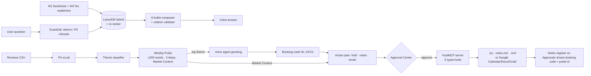

# Final Summary: Investor Ops & Intelligence Suite

This summary covers Phase 9.6. It lists what was built, how it was proven to work, and what is still open.
Design detail lives in [architecture.md](./architecture.md); eval detail lives in [evals.md](./evals.md).

## 1. What was built

The app is a single Streamlit entry point (`uv run streamlit run app.py`). It has a **Home** front door and two portals. The **Customer portal** holds **Ask** (Unified Search) and **Book a call** (the theme-aware voice agent). The **Admin portal** holds **Review pulse** (reviews CSV → Weekly Pulse, which briefs the agent and the advisor emails) and **Approvals** (the HITL Approval Center with the pre-booking notes register). The UI uses the layered "Linen & Caramel" design system ([DESIGN.md](../DESIGN.md)); evals and operator tools run from the CLI only. Three earlier milestones are combined into one product:

| Pillar | Built from | Result |
|--------|-----------|--------|
| **A. Smart-Sync KB** | M1 FAQ RAG + M2 Fee Explainer | Unified Search answers combined fact + fee questions in exactly 6 bullets, and every bullet cites M1 factsheet and/or M2 fee-explainer sources |
| **B. Theme-aware voice** | M2 Weekly Pulse + M3 voice scheduler | The greeting names the latest pulse's top theme. For bookable themes it offers a call on that theme; otherwise it points the caller to Help and lists the bookable topics |
| **C. HITL Approval Center** | M3 FastMCP tools + M2 Pulse | Ending a call queues a calendar hold, a notes line and an advisor email draft that includes the pulse's Market Context. Nothing executes until a human approves it |
| **Evals** | new | 4 suites, run with one command, producing Markdown and JSON reports and the submission report [`evalsReport.md`](./evalsReport.md) |

## 2. Eval results (final)

Run: `uv run python -m evals.run_evals`. It needs no API keys and uses mock adapters. Each suite runs in a throwaway sandbox.

| Eval | Metric | Baseline | Final | Threshold |
|------|--------|----------|-------|-----------|
| 1. RAG (G1–G5) | Faithfulness avg / min | 1.00 / 1.00 | 1.00 / 1.00 | ≥ 0.90 / ≥ 0.75 |
| | Relevance avg | 1.00 | 1.00 | ≥ 0.80 |
| | 6 bullets · M1+M2 sources | 5/5 · 5/5 | 5/5 · 5/5 | 5/5 |
| 2. Safety | Required S1–S3, on Unified Search **and** Voice, plus a persistence check | 7/7 | 7/7 | 100% |
| | Extended S1–S7 | 15/15 | 15/15 | 100% |
| 3. UX | Pulse ≤ 250 words with exactly 3 ideas | 3/3 (max 172 words) | 3/3 | all |
| | Voice greeting names the top theme (U1–U3) · extended | 3/3 · 5/5 | 3/3 · 5/5 | 3/3 |
| 4. Integration | Booking code in notes/calendar/email, HITL gate, Market Context, no PII, idempotency | **5/7** | **7/7** | all |

**Baseline → final.** The baseline run found two real issues; [evals.md §8](./evals.md#8-results--baseline--final) has the details.

1. The `.ics` `UID:…@investor-ops.local` line was falsely masked as a UPI ID. The UPI regex was fixed and a regression test added.
2. The idempotency check compared write flags that are *meant* to differ on a replay. It now requires the replay to hit the same object and report no new write.

Scoring is deterministic by default. Setting `EVAL_LLM_JUDGE=true` (plus a key) switches to the LLM judge. The final numbers above were produced without it.

## 3. Hardening (Phase 9)

| Check | Result |
|-------|--------|
| Tests | **469 passed** (`uv run pytest -q`): unit, integration, edge-case (`tests/edge/`), PII-sweep and UI (AppTest) tests; ruff and detect-secrets clean |
| Edge cases | 66 cases: 44 fully covered, 11 partially covered, 11 documented as different or not built ([edgeCase.md §6](./edgeCase.md#6-coverage-after-phase-91-as-built)) |
| PII sweep | `scripts/pii_sweep.py` found no PII in any free-text field (review text/title/user name, transcripts, notes, drafts, audit log). It flags 60 values: 58 `review_id` UUIDs and 2 digit runs inside a SEBI URL in `sources.csv`. All 60 are identifiers, not personal data, and each is labelled with a triage note. The detector was **not** loosened to hide them, so the script still exits 1. That is a conservative choice: precision was traded for recall |
| Latency | `scripts/latency_check.py` (LLM off): warm p50 is 0.50 s and p95 0.59 s for answered G1–G5; refusals take about 0 ms; the cold first call takes 3.7 s including model load. The target is p50 < 4 s ✅. With an LLM on, provider latency adds to this and was not measured, because no external calls were made |
| UI | Every page renders behind an error boundary, so one failing pillar shows a banner and the other pages keep working |

## 4. Problem-statement checklist

- [x] One Streamlit app with Home and two portals: Customer (Ask, Book a call) and Admin (Review pulse, Approvals). Guided hand-offs connect the pages.
- [x] Combined fact + fee answers in 6 bullets with citations (Eval 1).
- [x] The voice greeting changes with the latest pulse's top theme (Eval 3 U1–U3).
- [x] Ending a call creates a pending calendar hold and an email draft with Market Context. Nothing runs before approval (Eval 4 I2, I3, I5).
- [x] The booking code appears in the Notes doc, the calendar hold and the email draft (Eval 4 I4).
- [x] The eval suite runs with one command and writes a report. Safety is 100%.
- [x] No raw PII in the UI, logs, stored data or outputs. Simulated names are shown as `[REDACTED]` (Safety persistence check, PII sweep).

## 5. Known limitations

- **LLM paths are opt-in and were only tested with mocks.** These switches all default to off: `PULSE_LLM_ENABLED`, `VOICE_LLM_ENABLED`, `VOICE_STT_ENABLED`, `VOICE_TTS_ENABLED`, `EVAL_LLM_JUDGE`. Unified Search uses the LLM only when a key is set. Earlier Pillar A LiteLLM errors with a live key were never diagnosed; when they happen, the service falls back to the template/extractive composer.
- **Theme classifier.** It scores 86% on 50 hand labels, which is optimistic because the same person wrote the rules and the labels. Login issues map to the bookable *Account & App Access* topic.
- **Data.** There is an unresolved conflict between sources on the Large Cap minimum SIP. The corpus is a static snapshot (76 docs / 494 chunks, 30 funds across two AMCs).
- **Voice.** No waitlist booking when there are no free slots (V-07). No timezone conversion; all times are IST (V-09). Speech input is opt-in and has no confidence retry (V-14/V-15).
- **Pulse.** Non-English reviews are classified by keyword only, and quotes have no profanity filter (R-05, R-14).
- **Not delivered:** the demo video (9.5). The [README demo script](../README.md#demo-script--5-min) can be followed instead. Phoenix trace links and a Promptfoo red-team pass were also left out.
- **Google mode** has to be enabled by hand: run `uv run python -m pillar_c_mcp.google.auth`, then set `ADAPTER_MODE=google`, `GOOGLE_PREBOOKING_DOC_ID` and `ADVISOR_EMAIL`.

## 6. Clean install check

Task 9.7 was run on a brand-new virtualenv outside the repo (`UV_PROJECT_ENVIRONMENT=$(mktemp -d)/venv`), following only the README steps:

| Step | Result |
|------|--------|
| `uv sync --frozen --offline` | ✅ installed from `uv.lock`, using the local uv cache |
| `uv run pytest -q` | ✅ 464 passed |
| `uv run python -m evals.run_evals` | ✅ 4/4 suites passed |
| `uv run streamlit run app.py` | ✅ HTTP 200, `/_stcore/health` → `ok` |

The run reused the already-downloaded models in `.models/hf` and the built LanceDB index. On a truly fresh machine, `scripts/download_models.py` and `python -m pillar_a_kb.ingest` (README step 2) need network access once.
